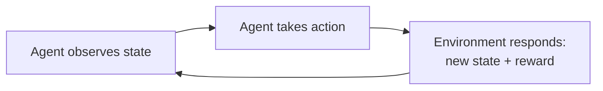
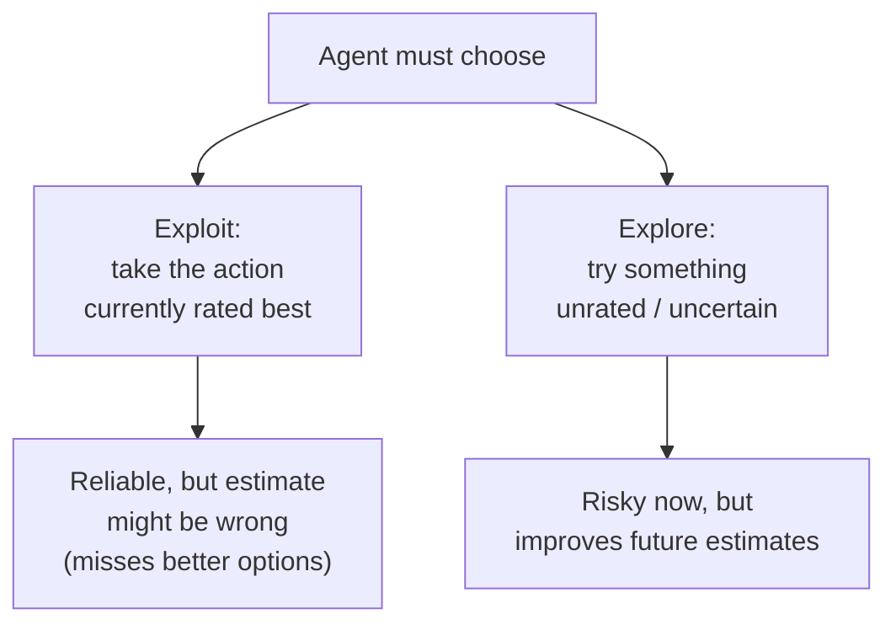

## A robot that has to choose

A mobile robot is sitting in a hallway with low battery. It can push deeper into the building looking for more trash to collect, or turn around and crawl back to its charger. Nobody tells it which to do. There's no labeled training example that says "in this exact hallway, with this exact charge level, the correct action is: go back." It has to decide, act, see what happens to its battery, and get better at this decision over time.

That's the shape of every problem in this book: an agent, an environment, and a loop.

> **Wait — isn't this just supervised learning with extra steps?** No. Supervised learning hands you a labeled example: situation → correct action, picked by a teacher who already knows the answer. Here, "in an essential way [these] are closed-loop problems because the learning system's actions influence its later inputs" — and crucially, "the learner is not told which actions to take... but instead must discover which actions yield the most reward by trying them out." There is no answer key. — *Section 1.1*

It's tempting to call this unsupervised learning instead, since there's no labeled answer key. That's wrong too: unsupervised learning is about finding hidden *structure* in data. Reinforcement learning is about maximizing a *reward signal*. The book is explicit about this: "reinforcement learning is trying to maximize a reward signal instead of trying to find hidden structure... we therefore consider reinforcement learning to be a third machine learning paradigm." — *Section 1.1*

## The four pieces every RL agent needs

| Element | What it is | Analogy |
|---|---|---|
| **Policy** | A mapping from states to actions — "the learning agent's way of behaving at a given time" | A stimulus-response habit |
| **Reward signal** | A single number from the environment each step, defining the goal | Pleasure / pain |
| **Value function** | An estimate of *total future reward* from a state | Foresight, "is this a good position to be in" |
| **Model** *(optional)* | Predicts how the environment will respond to an action | A mental simulation |

The distinction that trips people up most is **reward vs. value**. Reward is immediate and given to you by the environment — you can't change how it's computed, only influence it through your actions. Value is a *prediction*, and it's the thing you actually act on:

> "We seek actions that bring about states of highest value, not highest reward, because these actions obtain the greatest amount of reward for us over the long run." — *Section 1.3*

A state can hand you a lousy reward right now but have high value, because it reliably leads somewhere great next. Estimating that long-run value — not the immediate reward — turns out to be "the most important component of almost all reinforcement learning algorithms" in this book.

## Why you can't just always pick the best-known action

Say your agent has tried three actions and one of them looks best so far. Should it just keep doing that one forever?

No — and this is a dilemma unique to RL, absent from supervised and unsupervised learning in their pure forms: the **exploration–exploitation tradeoff**.

> **What breaks if you only exploit?** Your value estimates were built from limited experience. If you never try the second-best-looking action again, you never find out it was actually better — your policy locks onto a possibly-wrong belief forever. "The agent has to exploit what it already knows in order to obtain reward, but it also has to explore in order to make better action selections in the future... neither exploration nor exploitation can be pursued exclusively without failing at the task." — *Section 1.1*

## One limitation worth knowing up front

Most of this book assumes the agent can fully sense the true state of the environment. Real problems are often messier — "part of the state is hidden, or different states appear to the learner to be the same" — and that harder case (partial observability) is mostly out of scope here. Worth remembering as a boundary, not a detail to memorize.
