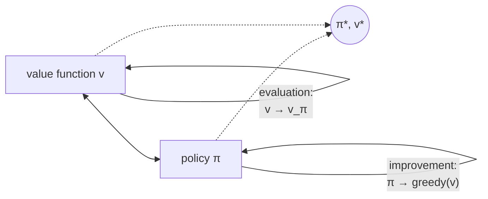

# Generalized Policy Iteration: the pattern behind (almost) the whole book

Step back and look at what policy iteration, value iteration, and asynchronous DP all actually share. Every one of them is two processes pulling on the same pair of objects — a value function and a policy:

- **Evaluation**: nudge the value function to be more consistent with the current policy.
- **Improvement**: nudge the policy to be greedier with respect to the current value function.

Policy iteration alternates them in big, complete chunks. Value iteration interleaves one sweep of each. Asynchronous DP interleaves them at the grain of a single state. Strip away "how granular" and "in what order," and what's left is the same loop:

> "We use the term generalized policy iteration (GPI) to refer to the general idea of letting policy evaluation and policy improvement processes interact, independent of the granularity and other details of the two processes. **Almost all reinforcement learning methods are well described as GPI.**" — Section 4.6

The two processes are simultaneously **competitors** and **collaborators**. Making the policy greedy w.r.t. `v` typically makes `v` stale for the new policy (evaluation has to catch up again); making `v` accurate for the current policy typically reveals it's no longer greedy (improvement has new work to do). They pull in opposite directions step to step — but jointly drag the pair toward the one point where *both* are simultaneously satisfied: `v = v_π` **and** `π = greedy(v)`. That joint fixed point is forced to be `v*, π*`, because it's exactly the Bellman optimality equation holding everywhere.

> **Why does this matter beyond Chapter 4?** Because this is the lens you'll use for *every* method in the rest of the book. Monte Carlo and TD methods (next two chapters) are GPI too — they just swap "exact sweep over the full model" for "sample backups from actual or simulated experience." When a later chapter's algorithm looks unfamiliar, ask: which part is evaluation, which part is improvement, and how granular is the interleaving? That question almost always orients you.

One more vocabulary term to bank: every DP method updates a state's value using *other estimated values*, not ground truth — value iteration's backup uses `v_k(s')`, itself just an estimate. This pattern — **bootstrapping**, updating estimates from other estimates — is a property DP has that Monte Carlo (next chapter) deliberately lacks, and TD (the chapter after) deliberately keeps. — Section 4.8
