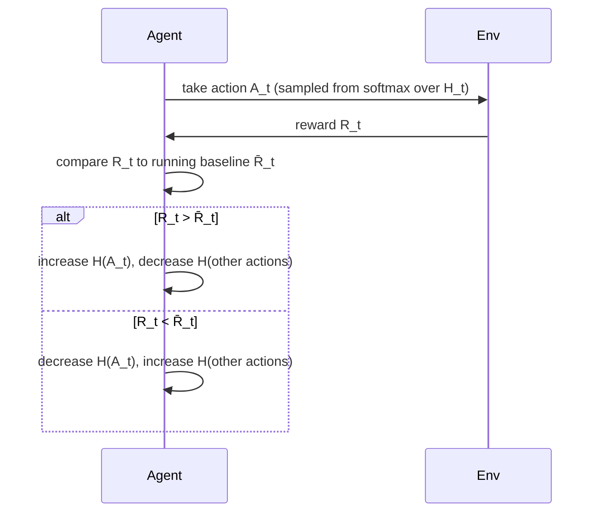

# Forget values — learn a preference instead

## A completely different idea

Every method so far estimates action *values* and picks the biggest one. Gradient bandits throw that out: instead they learn a numerical **preference** Hₜ(a) for each action, with no direct meaning in terms of reward at all — only the *relative* preference between actions matters (add 1000 to every preference, nothing changes).

Preferences turn into action probabilities via a **softmax**:

> "Pr{A_t = a} = e^{H_t(a)} / Σ_b e^{H_t(b)} = π_t(a)" — equation (2.9)

After taking action Aₜ and observing reward Rₜ, preferences update by stochastic gradient ascent:

> "H_{t+1}(A_t) = H_t(A_t) + α(R_t − R̄_t)(1 − π_t(A_t)), and H_{t+1}(a) = H_t(a) − α(R_t − R̄_t)π_t(a), ∀a ≠ A_t" — equation (2.10)

R̄ₜ is the running average reward (computed with the same incremental trick from Section 2.3) — it's a **baseline**. Reward above baseline → push the action's probability up, and every other action's probability down a little to compensate. Below baseline → push it down.

> **Wait — why bother with a baseline instead of just comparing to 0?** The book tests this directly: shift every true reward up by +4, and "this shifting up... has absolutely no affect on the gradient-bandit algorithm because of the reward baseline term, which instantaneously adapts to the new level. But if the baseline were omitted... performance would be significantly degraded" (Section 2.7). Without a baseline, a uniformly high-reward environment looks like every action is "good," so the algorithm can't tell which action is *relatively* better — it loses its signal.

The proof that this update really is gradient ascent on expected reward (not just a plausible-sounding heuristic) takes a page of calculus in the source text — worth knowing it exists, not worth memorizing: the expected value of the sampled update (2.10) equals the true performance gradient ∂E[Rₜ]/∂Hₜ(a). That's what "stochastic" gradient ascent means: each step is noisy, but right on average.

## The bridge to the rest of the book: when one situation becomes many

Every method in this chapter assumed a single, unchanging bandit — a **nonassociative** task: pick one best action, or track it as it drifts. But suppose you face *several* different bandits, switching randomly, and each time you're given a clue about which one you're facing (the book's example: a slot machine that changes color as its payouts change).

> "Now you can learn a policy associating each task, signaled by the color you see, with the best action to take when facing that task." — Section 2.8

This is an **associative search task**, now usually called a **contextual bandit**. It's the missing piece between bandits and the full reinforcement learning problem:

| Setting | Learns a policy? | Actions affect future state? |
|---|---|---|
| n-armed bandit (this chapter) | No — just one best action | No — only this step's reward |
| Associative search / contextual bandit | Yes — context → action | No — still only this step's reward |
| Full reinforcement learning (next chapter on) | Yes | **Yes** — your action changes what situation you face next |

That last row is the whole rest of the book. Chapter 3 formalizes it as a **finite Markov decision process**.
