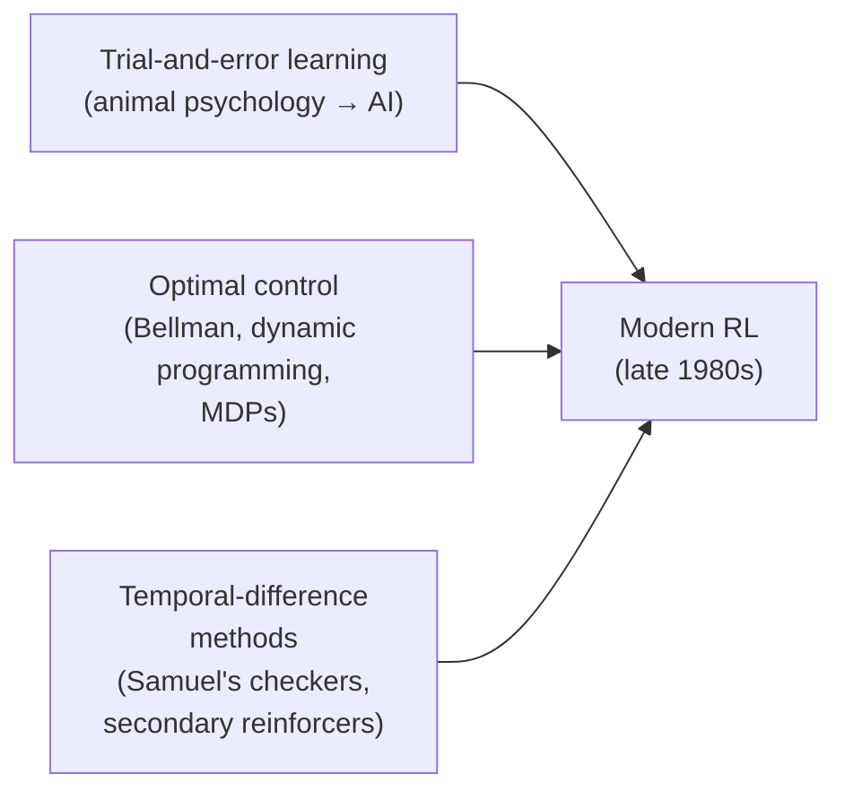

## Three rivers, one delta

Modern reinforcement learning didn't arrive as one idea — it's the confluence of three independent research threads that didn't talk to each other for decades.

**Thread 1 — trial and error.** Traces back to Thorndike's 1911 "Law of Effect": actions followed by satisfaction get reinforced, actions followed by discomfort get weakened. This became the language of "reward" and "punishment" — and was repeatedly *confused* with supervised learning along the way. The book is blunt about this: "Many researchers seemed to believe that they were studying reinforcement learning when they were actually studying supervised learning" — even neural-network pioneers like Rosenblatt used the language of rewards while building what were really pattern-classification systems. — *Section 1.7*

**Thread 2 — optimal control.** Richard Bellman's work in the 1950s gave this field its central tool: the **Bellman equation**, solved via **dynamic programming**. Crucially, this thread mostly *didn't involve learning* — it assumed you already had a complete model of the system. Connecting it to learning took until Chris Watkins's Q-learning in 1989.

**Thread 3 — temporal-difference learning.** The smallest, least distinct thread, but the one most unique to RL. Arthur Samuel's 1959 checkers program was first to use the idea: update your evaluation function based on the *difference between two successive estimates*, not a labeled answer. This is the same update rule you just saw in the tic-tac-toe example — V(s) ← V(s) + α[V(s′) − V(s)].

> **Why does it matter that these stayed separate for so long?** Because each thread had a piece the others lacked. Trial-and-error gave RL its experimental, no-model character. Optimal control gave it the value function and the Bellman equation. TD learning gave it an efficient, incremental way to estimate those values from raw experience instead of an exact model. The 1980s merger of all three — culminating in Watkins's Q-learning — is what makes modern RL able to learn *and* reason about long-term value at the same time.

One thread also produced a famous misattribution worth knowing for trivia purposes: the **credit assignment problem** — "how do you distribute credit for success among the many decisions that may have been involved in producing it?" — was named by Minsky in 1961, and "all of the methods we discuss in this book are, in a sense, directed toward solving this problem."
