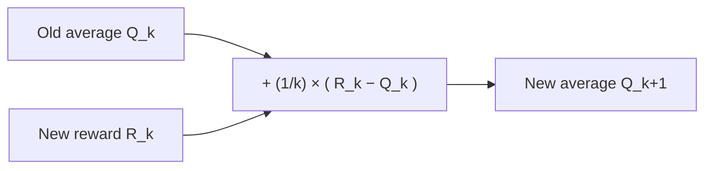

# Don't store the history — update the average

## The naive way breaks

To estimate an action's value Qₜ(a) as a sample average, the obvious approach is: keep every reward you've ever gotten from that action in memory, and recompute the average each time you need it.

> "A problem with this straightforward implementation is that its memory and computational requirements grow over time without bound." — Section 2.3

1,000 pulls in, you're summing 1,000 numbers just to make one decision. There's a cheaper way — and it's the single most-reused equation in this entire book.

## The incremental trick

Let Qₖ be the average of the first *k − 1* rewards for some action, and Rₖ be the *k*-th reward just received. A few lines of algebra collapse the running average into:

> "Q_{k+1} = Q_k + (1/k)[R_k − Q_k]" — equation (2.3)

No history. Just two numbers: the current average, and how many times this action's been picked. The general shape of this update reappears constantly through the rest of the book:

> "NewEstimate ← OldEstimate + StepSize [ Target − OldEstimate ]" — equation (2.4)

The bracketed term `[Target − OldEstimate]` is the **error**, and the update takes a step toward closing it. Here, the step size is `1/k` — it shrinks every time, because each new sample matters less to an average built from more and more data.

> **Wait — why does step size = 1/k specifically?** Because that's exactly what makes the running computation equal a true average (check: weight on each Rᵢ ends up 1/k for all i). Change the step size formula, and you're no longer averaging — you're doing something else entirely. Which is exactly the point of the next section.

## When the world keeps changing, stop trusting old data equally

A sample average treats reward #1 and reward #999 with equal weight. That's correct *if the world is stationary* — q(a) never changes. But most real environments drift: an ad's click-through rate decays, a recommender's catalog rotates, an opponent in a game adapts. For these **nonstationary** problems, recent rewards should count for more than stale ones.

The fix: replace the shrinking step size `1/k` with a **constant** α:

> "Q_{k+1} = Q_k + α[R_k − Q_k], where the step-size parameter α ∈ (0, 1] is constant." — equation (2.5)

Expand this recursively and you get an **exponential, recency-weighted average** — each past reward Rᵢ is weighted by α(1−α)^(k−i), so the weight on a reward decays exponentially the further back it was observed (Section 2.4, eq. 2.6). Smaller α → longer memory; α close to 1 → near-total amnesia, only the last reward matters.

## The fine print: which step-size sequences actually converge?

Stochastic approximation theory gives two conditions for an action-value estimate to converge with probability 1 as the step-size sequence αₖ(a) varies:

> "∑ αₖ(a) = ∞  and  ∑ αₖ(a)² < ∞" — equation (2.7)

| Condition | What it guarantees | Met by αₖ = 1/k? | Met by constant α? |
|---|---|---|---|
| ∑αₖ = ∞ | Steps stay large enough to overcome bad initial estimates | ✅ | ✅ |
| ∑αₖ² < ∞ | Steps eventually shrink enough to actually converge | ✅ | ❌ — sum is infinite |

Constant-α estimates **never fully converge** — they keep bouncing in response to recent rewards forever. That sounds like a flaw, but it's the *desired* behavior in a nonstationary world: an estimate that never stops adapting is exactly what tracking a moving target requires. The book is blunt about which case is more common in practice: "problems that are effectively nonstationary are the norm in reinforcement learning" (Section 2.4).
