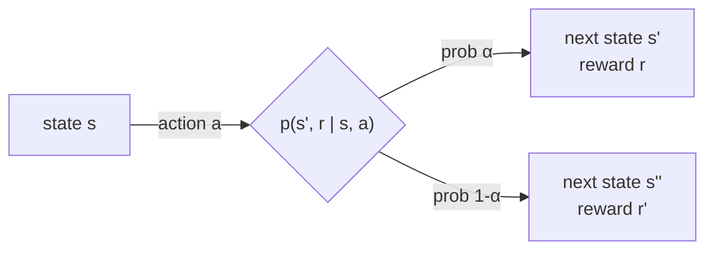

You're playing draw poker. A common instinct is to think a "perfect" state would include the contents of every player's hand and the cards left in the deck. But you can never observe that — and a fair game guarantees you never will. So what *should* "the state" mean, if not "everything"?

> "What we would like, ideally, is a state signal that summarizes past sensations compactly, yet in such a way that all relevant information is retained... never more than the complete history of all past sensations." — Section 3.5

A state with this property is called **Markov**: knowing it is exactly as useful for predicting the future as knowing the *entire history* that led to it. Formally, the environment's response at `t+1` depends only on `S_t, A_t` — not on `S_0, A_0, R_1, ..., S_t-1, A_t-1`:

```
p(s', r | s, a) = Pr{R_t+1=r, S_t+1=s' | S_t, A_t}
```

— Equation 3.5 — and this equals the full-history version (Equation 3.4) for *every* possible history. That's the whole definition: nothing from the path matters once you have the state.

> **Wait — doesn't the state need to capture everything that might matter?** No, the opposite trap is just as common. Section 3.5: "we don't fault an agent for not knowing something that matters, but only for having known something and then *forgotten* it." A blackjack agent isn't faulted for not knowing the next card — it was never observable. It would only violate the Markov property if it had seen the card and discarded that information from its state.

## A Markov state vs. a non-Markov one

| Example | Markov state | Why |
|---|---|---|
| Checkers | current board position | the full history of moves is irrelevant to what's optimal from here |
| Cannonball flight | current position + velocity | how it got that velocity doesn't change where it lands |
| Poker (your view) | your hand + bets so far + opponents' draw counts | the actual hidden cards aren't observable, so they can't be required |
| Coarse pole-balancer | "cart is in {left, middle, right}" | technically *not* Markov (loses precision) — yet RL still solves the task fine |

That last row is the practical lesson: real systems are almost never perfectly Markov, and that's fine. Treat the state as an *approximation* to a Markov state — the theory in this book assumes the Markov property strictly, but the algorithms still work well when it holds only approximately. The reward for getting closer to Markov is better performance, not a hard pass/fail.

## When the property holds: it's called an MDP

A reinforcement learning task that satisfies the Markov property is a **Markov decision process (MDP)**. With finite state and action sets, it's a **finite MDP** — and per Section 3.6, "finite MDPs are particularly important to the theory of reinforcement learning... they are all you need to understand 90% of modern reinforcement learning." Everything from here through Chapter 9 assumes one.

A finite MDP is completely defined by its dynamics function:

```
p(s', r | s, a) = Pr{S_t+1=s', R_t+1=r | S_t=s, A_t=a}
```

Everything else — expected reward `r(s,a)`, transition probabilities `p(s'|s,a)` — can be derived from this one function by summing over the dimension you don't care about.



This is exactly the recycling robot's transition graph from the previous lesson, generalized: every `(s, a)` pair fans out into possible `(s', r)` outcomes, each with a probability — and those probabilities, for a fixed `(s,a)`, always sum to 1.
