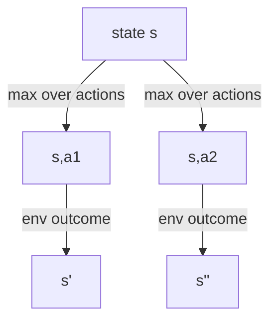
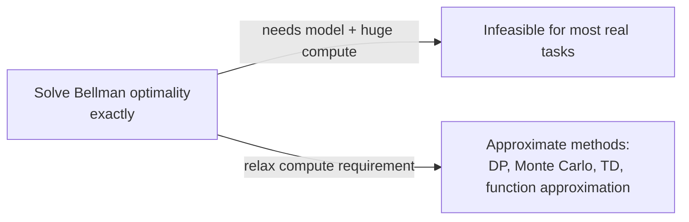

Backgammon has roughly `10^20` states. If you had the perfect dynamics model and infinite patience, you could in principle write down one Bellman equation per state and solve the whole system exactly — and get the mathematically *optimal* policy. The book's verdict: "it would take thousands of years on today's fastest computers." So why does the rest of this book even bother defining "optimal," if it's permanently out of reach?

## Optimal value functions: the ceiling, not the plan

A policy `π` is at least as good as `π'` if `v_π(s) ≥ v_π'(s)` for *every* state `s`. There's always at least one policy that beats or ties every other — call it `π*` (there may be many, but they all share the same value functions):

```
v*(s) = max_π v_π(s)          q*(s,a) = max_π q_π(s,a)
```

— Equations 3.13–3.14. `v*` and `q*` are unique to the MDP, even when the optimal policy itself isn't.



This is the **Bellman optimality equation** (Figure 3.7) — same shape as the regular Bellman backup diagram, but with one change: instead of *averaging* over the policy's action choices, you take the **max**. That's the entire mathematical difference between "how good is this state under policy π" and "how good can this state possibly be":

```
v*(s) = max_a Σ_{s',r} p(s',r|s,a) [ r + γ v*(s') ]
```

— Equation 3.17. Once you have `v*`, finding an optimal policy is almost trivial — be **greedy** with respect to `v*`: at every state, take whichever action attains that max. The hard long-horizon optimization is already baked into `v*`; the policy on top of it only needs a one-step lookahead.

> **Wait — if you have `q*` instead of `v*`, do you still need to look ahead?** No — that's `q*`'s whole appeal. "With `q*`, the agent does not even have to do a one-step-ahead search: for any state `s`, it can simply find any action that maximizes `q*(s,a)`." — Section 3.8. `q*` caches the result of the one-step search directly into the action axis, at the cost of representing a function over `(s,a)` pairs instead of just `s`.

## Why exact optimality is usually a fantasy

Solving the Bellman optimality equation exactly requires three assumptions, and real problems break at least one almost every time — Section 3.9:

| Assumption | Backgammon | Real robot |
|---|---|---|
| Accurate model of `p(s',r|s,a)` | known (game rules) | almost never known exactly |
| Enough compute to finish the computation | `10^20` states ⇒ no | usually no |
| The state is truly Markov | yes | usually only approximately |



The escape hatch is the one genuinely RL-specific idea in this section: an online agent doesn't need uniform accuracy across the whole state space. TD-Gammon plays at grandmaster level while almost certainly making bad decisions in states that experts simply never reach — because **on-line experience naturally concentrates learning effort on frequently visited states**, at the expense of rarely visited ones. That asymmetry — spend approximation budget where the agent actually goes, not where the state space happens to be large — is the thread that runs through every algorithm in the rest of the book.
