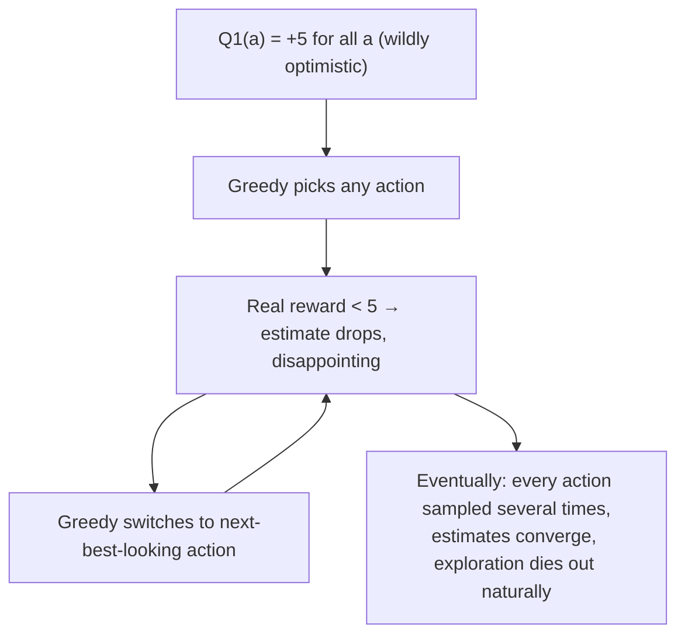

# Two ways to make exploration smarter, not just present

ε-greedy explores *indiscriminately* — when it explores, it picks uniformly at random from every non-greedy action, with "no preference for those that are nearly greedy or particularly uncertain" (Section 2.6). That's wasteful: an action you've already tried 500 times and an action you've never tried at all get the same chance of being explored next. Two fixes, each cheap and each used constantly later in the book.

## Trick 1: lie to yourself optimistically

Set every initial estimate Q₁(a) absurdly high — say +5, when true rewards average around 0. What happens?

> "Whichever actions are initially selected, the reward is less than the starting estimates; the learner switches to other actions, being 'disappointed' with the rewards it is receiving. The result is that all actions are tried several times before the value estimates converge." — Section 2.5

A purely **greedy** policy, with no ε at all, ends up exploring heavily anyway — not because it's *trying* to explore, but because every action initially looks disappointing compared to the inflated starting value. It's a clever hack, not a principled solution.

> **Wait — does this work for nonstationary problems too?** No, and this is the key limitation. "Any method that focuses on the initial state in any special way is unlikely to help with the general nonstationary case... the beginning of time occurs only once" (Section 2.5). Optimistic initialization is a *one-time* exploration jolt — once your estimates converge, the trick is spent. If the environment changes later, nothing brings exploration back.

## Trick 2: explore the actions you're least *sure* about

Instead of exploring randomly, target uncertainty directly. **Upper-Confidence-Bound (UCB)** action selection picks:

> "A_t = argmax_a [ Q_t(a) + c √(ln t / N_t(a)) ]" — equation (2.8)

Read the bracket as "estimated value, plus a bonus for how little we know." Nₜ(a) is how many times action a has been tried — small Nₜ(a) (rarely tried) inflates the bonus; the `ln t` numerator grows (slowly, since it's a log) every time *any* action is taken, so the bonus on an untried action keeps creeping up even while you're busy exploiting elsewhere.

| Term | Goes up when... | Effect |
|---|---|---|
| `Q_t(a)` | action a looks good so far | favors exploitation |
| `√(ln t / N_t(a))` numerator | time passes (any action taken) | bonus grows for actions left untried |
| `√(ln t / N_t(a))` denominator | action a is picked again | bonus shrinks — "we've reduced our uncertainty" |

Every action eventually gets picked (the bonus is unbounded as t grows), but actions that already look bad *and* have been tried a lot get picked less and less often. On the 10-armed testbed, "UCB seems to perform best" of all the methods compared (Section 2.9) — but it has a real cost: it's much harder to extend past bandits into full reinforcement learning, especially with large state spaces or function approximation, where "there is currently no known practical way of utilizing the idea of UCB action selection" (Section 2.6).

## Side by side

| Method | How it explores | Strength | Weakness |
|---|---|---|---|
| ε-greedy | Random, uniform over non-greedy actions | Simple, works under nonstationarity | Wastes exploration on clearly-bad actions |
| Optimistic init | Inflated initial estimates create temporary "disappointment" | Zero ongoing cost, simple | One-shot — useless once converged or if task changes |
| UCB | Targets actions with the most uncertainty | Best results on stationary testbed | Doesn't generalize cleanly beyond bandits |
