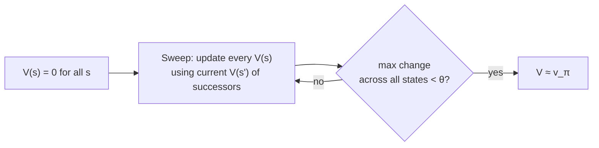

# Policy evaluation: how good *is* this policy, really?

You've got a policy — maybe it's just "always move randomly." You want a number for every state: *if I start here and follow this policy forever, what's my expected return?* That number is `v_π(s)`, and computing it is called **policy evaluation**.

Here's the trap: `v_π(s)` is defined in terms of `v_π` of every state that follows it. You can't compute one state's value without already knowing the others. It looks circular.

The fix is to stop demanding the exact answer and instead **iterate toward it**. Start with a guess — literally, set every `V(s) = 0`. Then repeatedly sweep through every state and replace its value with a one-step lookahead using your *current* (possibly wrong) estimates of its successors:

```
V(s) ← Σ_a π(a|s) Σ_{s',r} p(s',r|s,a) [ r + γ V(s') ]
```

> "Each successive approximation is obtained by using the Bellman equation for `v_π` as an update rule... the sequence `{v_k}` can be shown in general to converge to `v_π` as `k→∞`." — Section 4.1

This is **iterative policy evaluation**. Each full pass over every state is called a **sweep**, and replacing one state's value using its successors' values is a **full backup** — "full" because it uses *every* possible next state weighted by its probability, not just one sampled outcome. (Later chapters replace this with *sample* backups — that's the whole story of Monte Carlo and TD methods.)



> **Wait — won't using stale, wrong values for the successors just propagate the error forward?** Yes, briefly — but the *true* values are a fixed point of this update (plug in `v_π` and you get `v_π` back out). Every sweep makes the estimate strictly less wrong, the same way repeatedly averaging-in fresh information shrinks an error term. It converges in the limit; in practice you stop once the biggest per-sweep change (`Δ`) drops below a small threshold `θ`.

**Concrete picture: the 4×4 gridworld.** 14 nonterminal states, 4 actions (up/down/left/right), reward `−1` on every step until you hit the (single) terminal corner. Follow the *equiprobable random* policy — every action equally likely — and sweep:

| Sweep `k` | What you see |
|---|---|
| `k = 0` | All zeros (the arbitrary starting guess) |
| `k = 1` | Every state is `−1` (one step of real reward has propagated in) |
| `k = 2, 3, ...` | Values spread out: states near the corner settle near `−2, −3`; far states stay more negative |
| `k = ∞` | `v_π(s)` = the negative of the *expected number of steps* to termination under random play |

One subtlety worth banking: a real implementation needs **two arrays** (old values feeding the sweep, new values being written) — or you can update **in place**, letting fresher values leak into the same sweep. In-place is not just legal, it usually *converges faster*, and it's what DP algorithms use by default in practice. — Section 4.1
