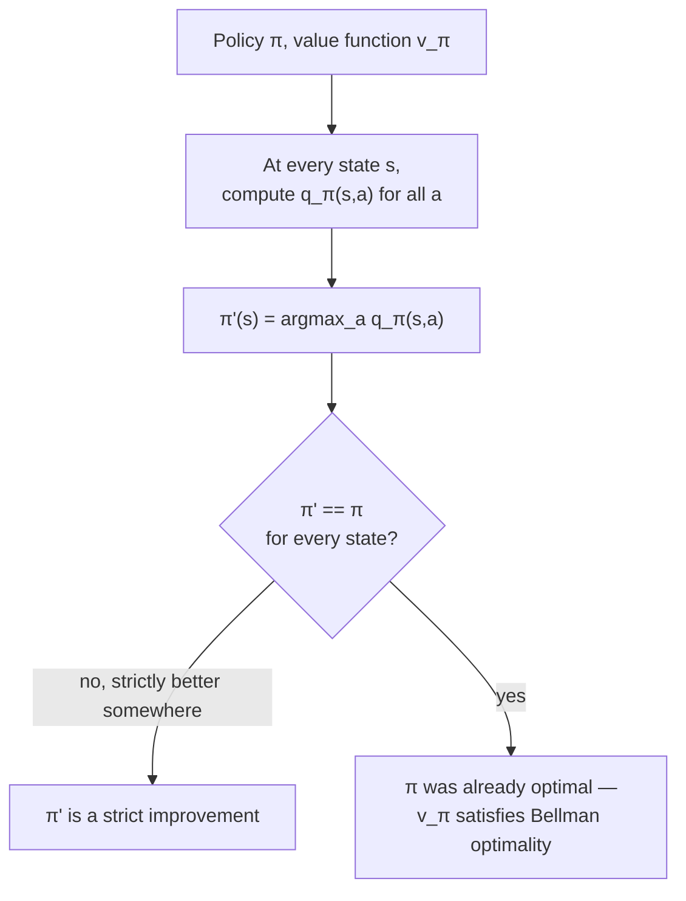

# Policy improvement: now that you can grade a policy, can you beat it?

You've got `v_π` for your current policy. Pick any state `s` and ask: *what if, just this once, I took a different action `a ≠ π(s)`, then went back to following `π` forever after?* The value of that one-step detour is:

```
q_π(s,a) = Σ_{s',r} p(s',r|s,a) [ r + γ v_π(s') ]
```

If `q_π(s,a) > v_π(s)` — the detour beats sticking with `π` — common sense says: switch to `a` in state `s` permanently, not just once. The **policy improvement theorem** says common sense is right, and proves something stronger:

> "Let `π` and `π'` be any pair of deterministic policies such that, for all `s`, `q_π(s,π'(s)) ≥ v_π(s)`. Then the policy `π'` must be as good as, or better than, `π`." — Section 4.2

So define the **greedy policy** with respect to `v_π` — at every state, take whichever action maximizes the one-step lookahead:

```
π'(s) = argmax_a Σ_{s',r} p(s',r|s,a) [ r + γ v_π(s') ]
```

By construction this `π'` satisfies the theorem's condition everywhere, so `π'` is guaranteed **at least as good** as `π` — never worse. That act of "go greedy w.r.t. the current value function" is **policy improvement**.



> **What's the catch — can this loop forever without converging?** No catch in the deterministic-finite case: improvement is strict everywhere it *can* improve, and a finite MDP has finitely many deterministic policies, so you can't cycle without revisiting and contradicting a strict-improvement step. If `π'` ties `π` everywhere, the algebra forces `v_π' = v_π = v_*` — both are already optimal. — Section 4.2

On the 4×4 gridworld: the greedy policy with respect to `v_π` for the *random* policy (whose values bottom out around `−14`) already has every state worth `−1`, `−2`, or `−3` — a strict improvement everywhere, and in this particular example it happens to land exactly on the optimal policy after just one improvement step.
