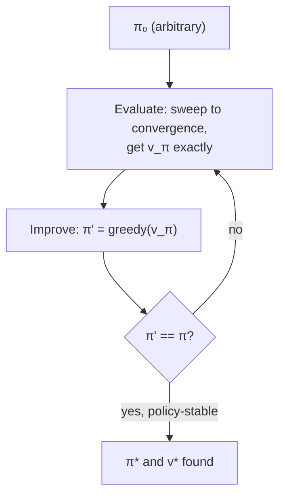

# Policy iteration: just keep alternating

You now have two moves: **evaluate** (compute `v_π` exactly) and **improve** (go greedy w.r.t. that `v_π`). What happens if you just... chain them, over and over?

```
π_0 --E--> v_π0 --I--> π_1 --E--> v_π1 --I--> π_2 --E--> ... --I--> π*
```

Each improvement step is guaranteed (by the theorem from the last lesson) to be at least as good as the last, and a finite MDP only has finitely many deterministic policies — so this can't wander forever. It has to land on `π*`.

> "Each policy is guaranteed to be a strict improvement over the previous one (unless it is already optimal)... this process must converge to an optimal policy and optimal value function in a finite number of iterations." — Section 4.3

This is **policy iteration**, and one detail makes it fast in practice: each evaluation step doesn't restart from `V = 0` — it warm-starts from the *previous* policy's value function, since the new policy usually isn't that different. On Jack's Car Rental — a continuing MDP with hundreds of states (cars at two rental lots, moving cars overnight at a cost) — policy iteration finds the optimal policy in only a handful of iterations.



The catch is cost: each "Evaluate" box is itself a full iterative computation that may take many sweeps to converge. For a big state space, that's expensive to pay *every single time you improve the policy a little*. That sets up the next question.
