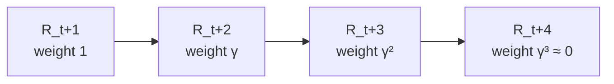
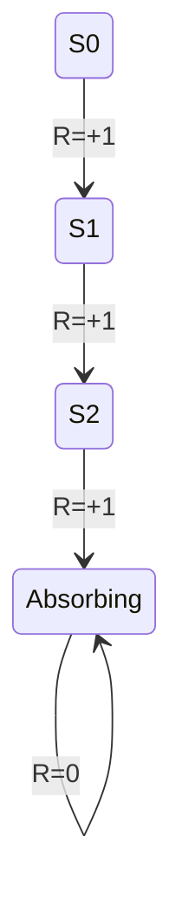

Suppose an agent gets reward `+1` at every single time step, forever. What's its total return? `∞`. Now you have two policies that both score `∞` — one that front-loads rewards, one that delays them. How do you tell them apart? You can't, not with a plain sum. That's the problem **discounting** solves.

## The simple sum first — and where it breaks

For tasks that naturally end — a hand of poker, a maze run, a chess game — there's a final time step `T`, and the return is just:

```
G_t = R_t+1 + R_t+2 + R_t+3 + ... + R_T
```

These are **episodic tasks**: the agent–environment loop breaks into episodes, each ending in a terminal state, then resetting. But many tasks never end — a thermostat, a long-lived trading agent, a robot with no shutdown date. These are **continuing tasks**, and for them `T = ∞`. Sum infinitely many `+1`s and you get `∞` — useless for comparing policies.

## Discounting: a knob for how farsighted the agent is

```
G_t = R_t+1 + γR_t+2 + γ²R_t+3 + ... = Σ_{k=0}^∞ γ^k R_t+k+1
```

— Equation 3.2, where `γ` (the **discount rate**) sits in `[0, 1]`. A reward `k` steps away is worth only `γ^(k-1)` of its face value today. If `γ < 1` and rewards are bounded, the infinite sum converges to a finite number no matter how long the agent lives — discounting is what makes "forever" mathematically tractable.



`γ` is a dial, not a switch:

- **`γ = 0`** — fully myopic. The agent only cares about `R_t+1`; the entire infinite future is worth zero to it right now.
- **`γ → 1`** — fully farsighted. Distant rewards count almost as much as immediate ones.

> **Wait — won't a myopic agent (`γ=0`) just maximize total reward by maximizing each step?** Only if its actions don't affect the future. Section 3.3: "in general, acting to maximize immediate reward can reduce access to future rewards so that the return may actually be reduced." A chess agent maximizing only the next move's reward would happily walk into checkmate next turn if checkmate isn't the *immediate* signal.

## One notation for both kinds of task

Rather than maintaining two formulas forever, the book unifies them with a trick: treat episode termination as entering a special **absorbing state** that loops to itself forever, emitting reward `0` on every step after.



Sum the first `T` rewards or sum the infinite tail past `T` — same answer, because everything after termination contributes zero. That lets you write one formula that covers both cases:

```
G_t = Σ_{k=0}^{T-t-1} γ^k R_t+k+1
```

— Equation 3.3, allowing `T = ∞` or `γ = 1`, but never both at once (an undiscounted, never-ending sum is exactly the divergence problem you started with).
