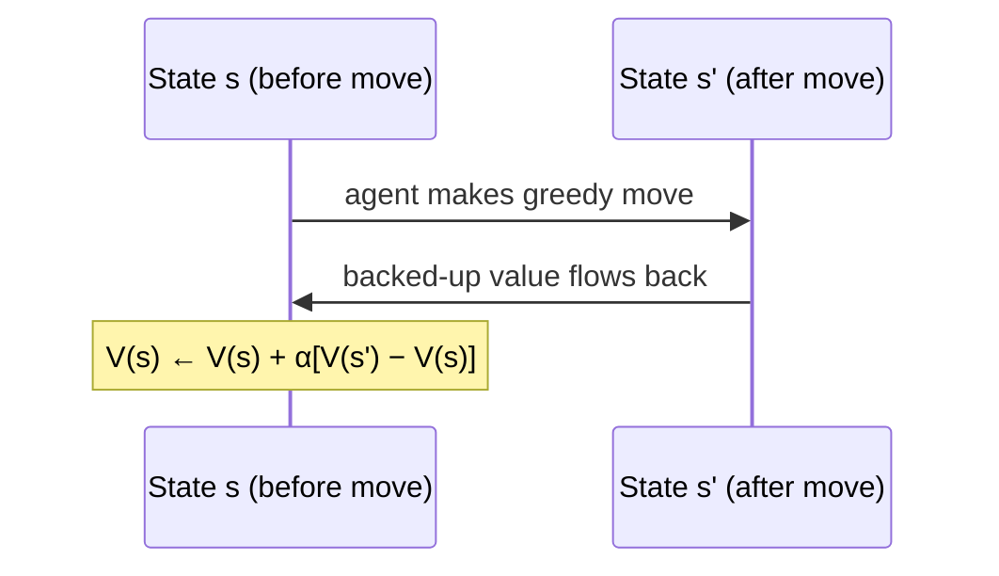

## Could you write a tic-tac-toe player without RL?

Sure — but watch what each "obvious" approach actually requires:

- **Minimax** assumes the opponent plays perfectly. Against a sloppy human, minimax leaves wins on the table — "a minimax player would never reach a game state from which it could lose, even if in fact it always won from that state because of incorrect play by the opponent." — *Section 1.5*
- **Dynamic programming** needs a complete model of the opponent — the exact probability they make each move in each position. You don't have that a priori.
- **Evolutionary search** plays whole games with a fixed policy, then judges only the final win/loss. "Credit is even given to moves that never occurred!" — every move in a won game gets equal credit, even the bad ones.

What you actually have is *experience*: you can play the opponent repeatedly and notice, move by move, which positions tend to work out.

## The value-table approach

Set up one number per board state: your current best guess at the probability of winning from there.

- States with three of your marks in a row → value **1** (you already won)
- States with three opponent marks, or full boards → value **0** (you can't win)
- Everything else → start at **0.5** (a shrug — 50/50 guess)

Play games. Mostly pick the move that leads to the highest-valued next state (**greedy**). Occasionally pick a different move at random (**exploratory** — see the previous lesson). Exploratory moves don't get to teach you anything; the *greedy* ones do.

## The update rule — and why it's called "temporal-difference"

After each greedy move, nudge the *earlier* state's value toward the *later* state's value:

> V(s) ← V(s) + α[V(s′) − V(s)]

where α is a small step-size controlling how fast you learn. The book names this precisely: "This update rule is an example of a temporal-difference learning method, so called because its changes are based on a difference, V(s′) − V(s), between estimates at two different times." — *Section 1.5*

There's no opponent model anywhere in this. The player never simulates "what will my opponent do." It just keeps revising one number per state based on what state followed. And yet: "if the step-size parameter is reduced properly over time, this method converges, for any fixed opponent, to the true probabilities of winning... the method converges to an optimal policy."

> **Wait — doesn't it need to look ahead to know what state results from each move?** It does use a model here — of the *game rules* (it can compute "if I place an X here, the board becomes this") — but not of the *opponent*. Those are different things. Tic-tac-toe is "model-free... with respect to its opponent: it has no model of its opponent of any kind." — *Section 1.5*

## This scales further than it looks

The same value-table idea, swapped from a lookup table to a neural network, is exactly what let Gerry Tesauro's TD-Gammon learn backgammon — a game with roughly 10²⁰ states, far too many to ever store in a table. Generalizing from similar-but-not-identical states experienced before is what makes that possible.
