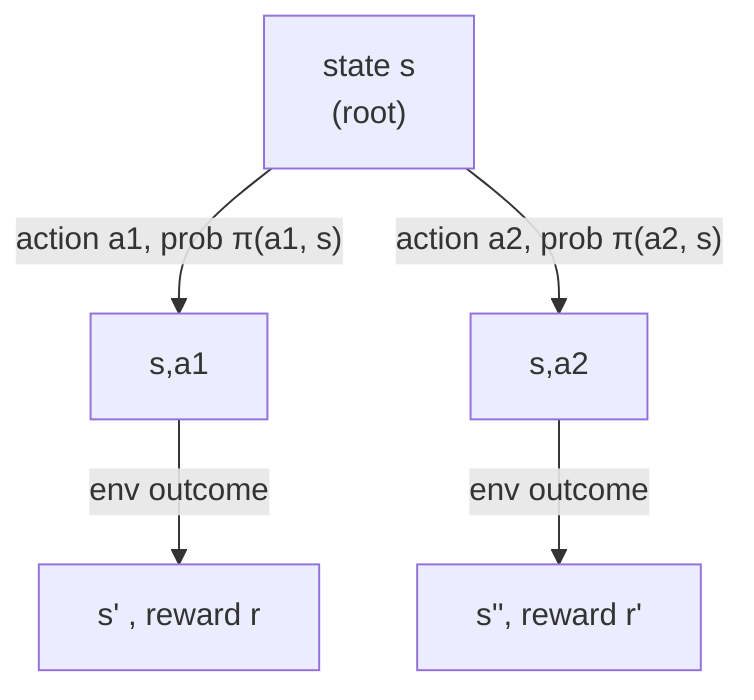

Two golf clubs, same hole. A driver gets you closer in one swing but you might still need three putts after a bad lie; a putter is safe but slow. Which "state" — ball position, after which club — is actually better? You can't answer by looking at the next stroke alone. You need *how much it costs from here to the end*. That's a value function.

> "value functions—functions of states (or of state–action pairs) that estimate how good it is for the agent to be in a given state... defined in terms of expected return." — Section 3.7

```
v_π(s) = E_π[G_t | S_t = s]
```

— Equation 3.10: the expected return starting in `s` and following policy `π` forever after. There's a sibling for state-*action* pairs:

```
q_π(s, a) = E_π[G_t | S_t = s, A_t = a]
```

— Equation 3.11: expected return for taking action `a` in `s`, then following `π`. The difference matters: `v_π` answers "how good is this state under my current policy", `q_π` answers "how good is *this specific action* here" — which is what you need to actually compare actions and improve a policy.

## The gridworld that explains itself

In the book's running gridworld, every move gives reward 0, hitting a wall gives `−1`, and two special cells `A` and `B` teleport you elsewhere for `+10` / `+5`. Under a policy that picks all four directions with equal probability, state `A`'s value comes out to *less* than its immediate `+10` reward — because the very next move likely drifts toward a wall. State `B`, despite a smaller `+5` reward, ends up valued *higher* than its own immediate reward, because it lands somewhere good. **The reward you get this step and the value of the state are different numbers, and it's the value that tells you which state is actually good to be in.**

## Bellman's insight: value is recursive

Unroll the definition of `G_t` by one step and you get a relationship between a state's value and its successors' values — the **Bellman equation**:

```
v_π(s) = Σ_a π(a|s) Σ_{s',r} p(s',r|s,a) [ r + γ v_π(s') ]
```

— Equation 3.12. In words: *the value of a state equals the expected immediate reward, plus the discounted value of whatever state you land in next* — averaged over every action your policy might take and every outcome the environment might produce.



This is the book's **backup diagram** for `v_π` (Figure 3.4a) — and it's not decoration, it's the literal computation: average over the action branch, then average over the environment-outcome branch, discount, add the reward. Every value-based algorithm in the rest of this book — dynamic programming, Monte Carlo, TD learning — is some variant of running this backup, either exactly or from sampled experience.

> **Wait — is the Bellman equation an approximation or exact?** It's an exact identity that `v_π` is *guaranteed* to satisfy — in fact `v_π` is defined as the *unique* solution to it. The approximating happens later, in how you *compute* a solution (Chapters 4–9), not in the equation itself.
