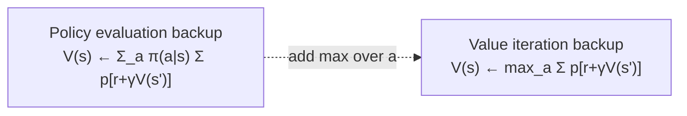

# Value iteration: what if you don't wait for evaluation to converge?

The expensive part of policy iteration is running policy evaluation *to convergence* before every single improvement. Do you actually need to wait? In the gridworld example, the greedy policy stopped changing after about 3 sweeps even though the value function kept evolving for many more. Most of that "waiting" bought nothing.

So: truncate. Stop policy evaluation after exactly **one sweep**, then immediately improve. Folding evaluation and improvement into a single backup gives:

```
v_k+1(s) = max_a Σ_{s',r} p(s',r|s,a) [ r + γ v_k(s') ]
```

> "Value iteration... can be written as a particularly simple backup operation that combines the policy improvement and truncated policy evaluation steps... value iteration is obtained simply by turning the Bellman optimality equation into an update rule." — Section 4.4

Compare this to last lesson's policy-evaluation backup — it's *identical* except for one `max`. That one `max` is the entire difference between "evaluate this fixed policy" and "find the optimal policy directly."



On the **gambler's problem** (stake money on coin flips, reach 100 dollars to win, `p_heads = 0.4`), value iteration's value-function estimate visibly reshapes over ~32 sweeps into a curiously spiky optimal policy — and you don't need an explicit policy object at any intermediate step; you only extract `π*` once at the end, by taking the argmax of the final `V`.

> **Wait — is value iteration just "policy iteration but worse"?** No: it's policy iteration with the inner evaluation loop truncated to one sweep, which removes most of the per-iteration cost while keeping the same convergence guarantee. You can also truncate to *k* sweeps for any *k* — full policy iteration and value iteration are the two ends of one family called **truncated policy iteration**. — Section 4.4

## Code challenge

Implement a single synchronous value-iteration backup over a tiny MDP described as a model: each state maps to its available actions, each action maps to a deterministic `{ next, reward }`. A state with no actions is terminal and stays at value 0.
