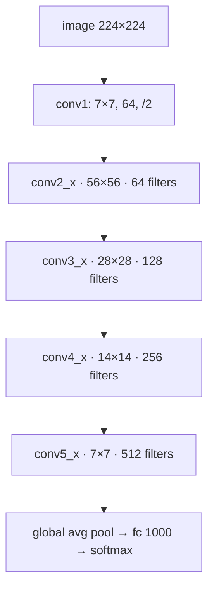

# Building the whole network: deeper *and* cheaper

ResNet didn't invent a baroque new architecture. The plain baseline follows the
**VGG philosophy** (Section 3.3), with two rules that keep the per-layer cost
constant:

1. For the same output feature-map size, layers keep the **same number of
   filters**.
2. When the feature map is **halved** (downsampled), the filter count is
   **doubled** — so the work per layer stays roughly constant.

Downsampling happens *inside* convolutions with stride 2 (no pooling between
stages), and the net ends with global average pooling + a 1000-way softmax.

Turn the plain net into a ResNet by dropping a shortcut across every pair of
3×3 layers. Solid shortcuts where dimensions match; the dotted ones (at each
stage boundary, where channels double and size halves) handle the dimension jump.

## The counterintuitive part: deeper but *lower* complexity

You'd assume 152 layers must cost a fortune. It doesn't:

| Model | Depth | FLOPs (billions) |
|---|---|---|
| VGG-19 | 19 | 19.6 |
| VGG-16 | 16 | 15.3 |
| ResNet-34 | 34 | **3.6** |
| ResNet-50 | 50 | 3.8 |
| ResNet-101 | 101 | 7.6 |
| ResNet-152 | 152 | **11.3** |

> Our 152-layer residual net is the deepest network ever presented on ImageNet,
> while still having **lower complexity than VGG nets**. — *Section 1*

The 34-layer ResNet is only **18% of VGG-19's FLOPs** (3.6 / 19.6). Even the
152-layer monster (11.3B) undercuts VGG-16 (15.3B). How? VGG spends enormous
compute on huge fully-connected layers and wide 3×3 stacks at high resolution;
ResNet uses global average pooling (no giant FC), smaller widths, and bottleneck
blocks.

> **So is "depth" the same as "compute"?** No — and that's the point. ResNet
> decouples them. The gains in the next lesson come from *depth* (more
> sequential nonlinear transformations), achieved at *less* total compute than
> the shallower VGG.

The 18/34/50/101/152 family is built by stacking the same blocks more times
(Table 1). Going from 34 to 50 layers means swapping each 2-layer block for a
3-layer bottleneck block — same idea, more of it.
