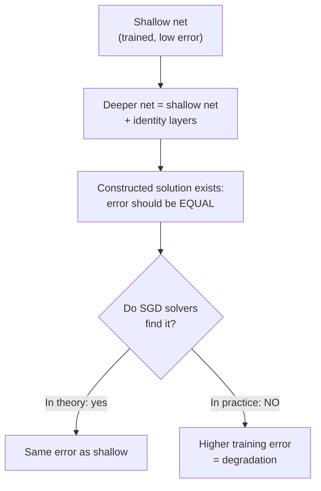

# The deeper network that learned *worse*

Here's a result that should feel wrong. Take a 20-layer plain convolutional net.
Train it on CIFAR-10. Now take a **56-layer** version of the same network — more
capacity, more parameters — and train it the same way.

The 56-layer net has **higher training error**. Not test error — *training*
error. The deeper model can't even fit the data as well as the shallow one.

> **Wait — isn't that just overfitting?** No. Overfitting means low *training*
> error and high *test* error. Here the deeper net is worse on the data it's
> being trained on. The paper is explicit: *"such degradation is not caused by
> overfitting, and adding more layers to a suitably deep model leads to higher
> training error"* (Section 1).

The authors call this the **degradation problem**: *"with the network depth
increasing, accuracy gets saturated ... and then degrades rapidly."*

## Why this is paradoxical

There's a solution to the deeper network sitting right in front of us. Take the
trained shallow network. Add extra layers on top. Make every added layer an
**identity mapping** — it just copies its input to its output. Now the deeper
network computes *exactly* the same function as the shallow one, so it must have
*the same* training error. Not worse.

So a deeper model should produce **no higher** training error than its shallower
counterpart. The construction proves it's *possible*. But — and this is the whole
paper — *"experiments show that our current solvers on hand are unable to find
solutions that are comparably good or better than the constructed solution."*

## It's not vanishing gradients

The classic suspect for "deep nets won't train" is vanishing/exploding gradients.
The authors rule it out: these plain nets use **batch normalization**, so forward
signals have healthy non-zero variance *and* backward gradients have healthy
norms. *"So neither forward nor backward signals vanish"* (Section 4.1).

The problem isn't that the signal dies. It's that **the optimizer can't find a
good deep solution even though one provably exists.** Stacking layers makes the
function harder to *optimize*, not impossible to *represent*.

That single observation — representable but not optimizable — is the crack the
whole ResNet idea pries open.
