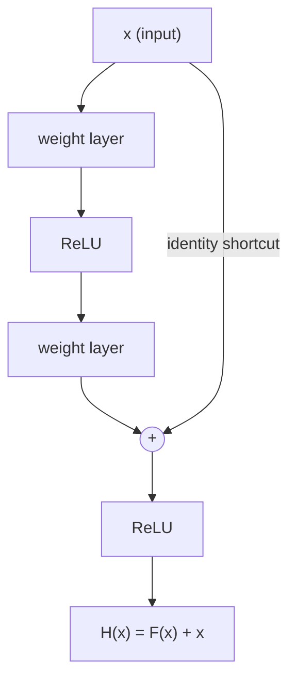

# Learn the *change*, not the whole function

We just saw the trap: a stack of layers struggles to learn an identity mapping,
even when identity is the optimal thing to do. ResNet's fix is almost
embarrassingly simple — **change what the layers are asked to learn.**

Call the function we *want* a few stacked layers to compute `H(x)`. The usual
approach asks the layers to produce `H(x)` directly. ResNet instead asks them to
produce the **residual**:

> Denote the desired underlying mapping as H(x); we let the stacked nonlinear
> layers fit another mapping of **F(x) := H(x) − x**. The original mapping is
> recast into **F(x) + x**. — *Section 3.1*

So the layers learn `F(x)` (the *difference* from the input), and we add the input
back at the end via a **shortcut connection**:

That `+` is element-wise addition. The curved path carrying `x` straight to the
adder is the shortcut — it skips the weight layers entirely.

## Why this makes optimization easier

Go back to the case that broke the plain net: **the optimal mapping is the
identity.** What does each formulation have to do?

| | Target the layers must produce | What it takes |
|---|---|---|
| Plain net | `H(x) = x` | Stack of nonlinear layers must *learn* to copy the input |
| Residual net | `F(x) = 0` | Just drive all the weights toward zero |

> To the extreme, if an identity mapping were optimal, it would be easier to push
> the residual to zero than to fit an identity mapping by a stack of nonlinear
> layers. — *Section 1*

Pushing weights to zero is something SGD does *naturally* (weight decay even
pushes that way for free). Sculpting several nonlinear layers into an exact
identity is not.

## The preconditioning argument

Real optimal mappings are rarely *exactly* identity. But the authors argue
identity is a good **reference point**:

> If the optimal function is closer to an identity mapping than to a zero mapping,
> it should be easier for the solver to find the perturbations with reference to
> an identity mapping, than to learn the function as a new one. — *Section 3.1*

And they checked: the learned residual functions have **small responses** on
average (Figure 7), which means most blocks *are* making small adjustments to
their input — exactly what you'd expect if identity is a good baseline and `F` is
just a gentle correction.

> **Doesn't adding the shortcut cost something?** Almost nothing. *"Identity
> shortcut connections add neither extra parameter nor computational
> complexity"* — it's one element-wise add. The network still trains end-to-end
> with plain SGD, no solver changes (Section 1).
