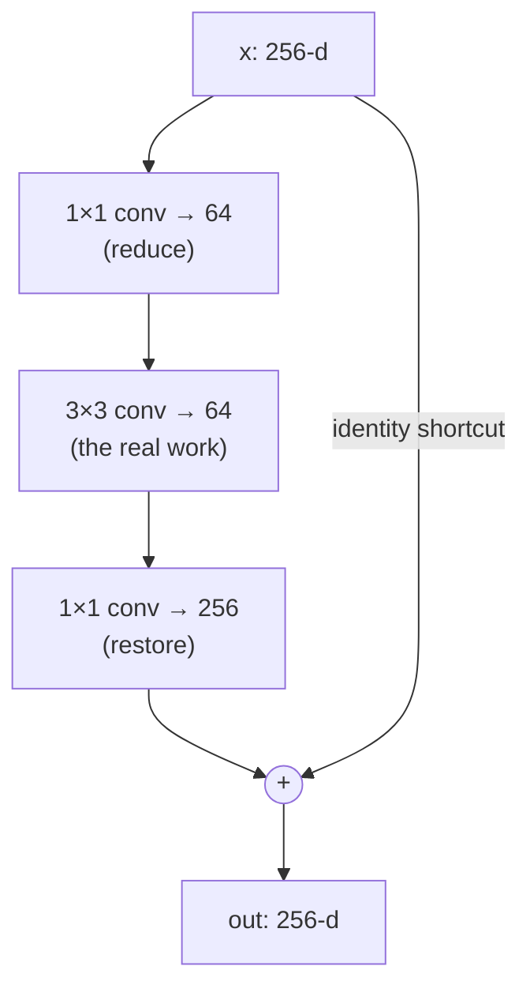

# Shortcuts: when the dimensions don't line up

The residual block is one equation:

> **y = F(x, {Wᵢ}) + x** — *Eq. (1), Section 3.2*

For the two-layer block, `F = W₂σ(W₁x)` where `σ` is ReLU. The shortcut just
adds `x` back. Clean — *as long as `x` and `F` have the same shape*. The
element-wise add needs matching dimensions.

But networks shrink their feature maps and grow their channel counts as they go
deeper (28×28×128 → 14×14×256, say). When the channels change, `x` (say 128-d)
and `F(x)` (256-d) **can't be added**. The paper gives two options:

| Option | What the shortcut does | Extra params? |
|---|---|---|
| **A** — zero-pad | Identity, with extra **zero entries padded** for the new channels | None |
| **B** — projection | A linear projection `Wₛx` (a 1×1 conv) to match dimensions, `y = F(x) + Wₛx` (Eq. 2) | Yes |

> We will show by experiments that the identity mapping is sufficient for
> addressing the degradation problem and is economical, and thus Wₛ is only used
> when matching dimensions. — *Section 3.2*

In other words: use a plain identity shortcut everywhere you can; only spend
parameters on a projection at the few places where the dimension actually jumps.
Their experiments (Table 3) confirm A, B, and C (projections everywhere) are all
close — projections are **not essential**, so they aren't worth the cost.

## The bottleneck block: buying depth cheaply

To go really deep (50/101/152 layers) without the compute exploding, ResNet swaps
the two-layer block for a three-layer **bottleneck** (Figure 5, right):

The trick: the expensive 3×3 convolution runs on a **squeezed** 64-channel
tensor, not the full 256. The cheap 1×1 convs reduce the channels going in and
restore them coming out. *"The 1×1 layers are responsible for reducing and then
increasing (restoring) dimensions, leaving the 3×3 layer a bottleneck with
smaller input/output dimensions"* (Section 4.1).

## Why identity shortcuts *really* matter here

In the bottleneck design, the shortcut connects the two **high-dimensional** ends
(256-d to 256-d). That makes the choice of shortcut suddenly expensive:

> If the identity shortcut ... is replaced with projection, one can show that the
> time complexity and model size are **doubled**, as the shortcut is connected to
> the two high-dimensional ends. — *Section 4.1*

A 256→256 projection is a 256×256 matrix — roughly as many parameters as the
whole bottleneck block itself. So a free identity shortcut isn't just elegant
here; it's what keeps the deep models affordable. You'll compute exactly how much
it saves in the next lesson.
