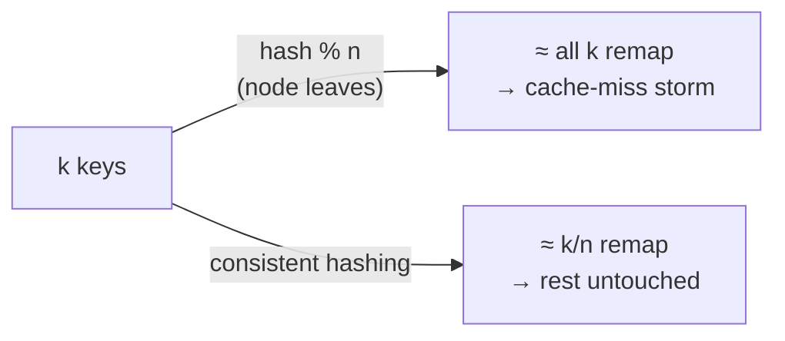
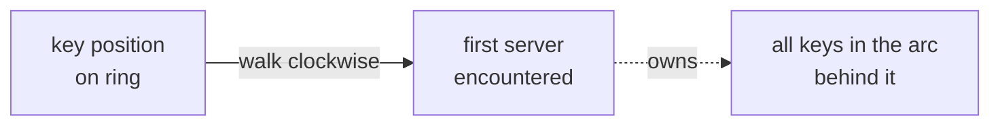

# Consistent hashing

To spread data evenly across *n* servers, the obvious trick is `serverIndex = hash(key) % n`. It works — until *n* changes. Drop one server and **n** becomes **n−1**, so `hash(key) % n` returns a *different* index for almost every key. Nearly all keys remap at once, every client suddenly asks the wrong server, and you get a **storm of cache misses** exactly when a node is already struggling.

Consistent hashing is the fix: when the table is resized, only **k/n** keys move on average (k = keys, n = slots), instead of nearly all of them.

## The hash ring

Take the hash function's whole output space — for SHA-1 that's `0 … 2^160 − 1` — and bend it into a **ring** by joining the two ends. Then:

1. Hash each **server** (by IP or name) to a point on the ring.
2. Hash each **key** to a point on the same ring — note: no `% n` here.
3. To find a key's server, walk **clockwise** from the key until you hit the first server.

Now adding **server 4** only steals the keys in the arc between it and the previous server (counter-clockwise) — every other key stays put. Removing a server hands *only its own arc* to the next server clockwise. That's the k/n promise made concrete.

## Virtual nodes fix the lumpiness

The basic ring has two flaws: server arcs end up **unequal sizes** (remove one server and its neighbor inherits a double-width arc), and keys can pile up so one server holds most of them while others sit idle.

The fix is **virtual nodes**: each physical server is placed at *many* points on the ring (`s0_0, s0_1, s0_2, …`), not one. A key still walks clockwise to the nearest virtual node, which maps back to a real server. More virtual nodes → smaller standard deviation in load: experiments show ~10% deviation at 100 vnodes, ~5% at 200. The tradeoff is memory to track them all — so you tune the count.

| Property | Without vnodes | With many vnodes |
|---|---|---|
| Arc/partition sizes | Uneven | Near-uniform |
| Key distribution | Can be lopsided | Balanced (low std-dev) |
| Cost | Cheap | More metadata to store |

When a node is added or removed, the **affected key range** is the arc between the changed node and its neighbor — only those keys redistribute. This is why consistent hashing also **mitigates hotspot keys** (the Katy-Perry-on-one-shard problem) and why it underpins Dynamo, Cassandra, Discord, Akamai, and Maglev.
