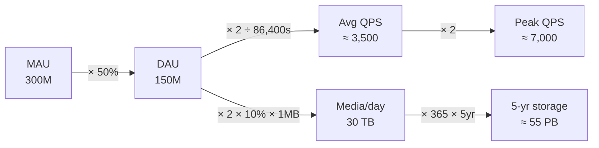

# Back-of-the-envelope estimation

Sometimes the interviewer wants a number: how many queries per second? How much storage in five years? You won't have a spreadsheet — you'll have your head and a whiteboard. As Jeff Dean put it, these are estimates built from "thought experiments and common performance numbers to get a good feel for which designs will meet your requirements." The number is approximate; the *reasoning* is what's graded.

## Three things you must know cold

**Powers of two.** Data volume is counted in powers of 2. A byte is 8 bits; an ASCII char is 1 byte.

| Power | Approx | Unit |
|---|---|---|
| 2^10 | 1 thousand | 1 KB |
| 2^20 | 1 million | 1 MB |
| 2^30 | 1 billion | 1 GB |
| 2^40 | 1 trillion | 1 TB |
| 2^50 | 1 quadrillion | 1 PB |

**Latency numbers (Dean, the orders of magnitude that matter).** Exact values age; the *ratios* don't.

| Operation | Rough time |
|---|---|
| L1 cache reference | ~1 ns |
| Main memory reference | ~100 ns |
| Read 1 MB sequentially from memory | ~250 µs |
| Round trip within a data center | ~500 µs |
| Disk seek | ~10 ms |
| Read 1 MB from disk | ~30 ms |
| Send packet CA → Netherlands → CA | ~150 ms |

The takeaways: **memory is fast, disk is slow — avoid seeks**; compression is cheap, so **compress before sending over the network**; and **cross-region traffic is expensive**.

**Availability numbers.** Uptime is measured in "nines." Cloud providers promise 99.9%+.

| Availability | Downtime / year |
|---|---|
| 99% | ~3.65 days |
| 99.9% | ~8.77 hours |
| 99.99% | ~52.6 minutes |
| 99.999% | ~5.26 minutes |

## The canonical worked example: Twitter

Assume (illustrative, not real Twitter): **300M** monthly active users, **50%** daily, **2** tweets/user/day, **10%** of tweets carry media, retained **5 years**.

**QPS** — from users to a per-second rate:
- DAU = 300M × 50% = **150M**
- Tweets/sec = 150M × 2 ÷ 24h ÷ 3600s ≈ **3,500 QPS**
- Peak QPS = 2 × average ≈ **7,000 QPS**

**Storage** — media only:
- Average sizes: `tweet_id` 64 B, `text` 140 B, `media` 1 MB
- Media/day = 150M × 2 × 10% × 1 MB = **30 TB/day**
- 5-year media = 30 TB × 365 × 5 ≈ **55 PB**

Notice the *shape* of every estimate: start from population, multiply down to a per-second or per-day rate, then up to a horizon. Peak ≈ 2× average is the standard fudge factor.

## How to actually do it under pressure

- **Round and approximate.** "99,987 / 9.1" is "100,000 / 10". Precision is not the point; speed and a defensible figure are.
- **Write down assumptions.** State "50% DAU, 2 tweets/day" on the board so you can reference — and revise — them.
- **Label units.** "5" is ambiguous; "5 MB" is not. Mislabeled units are the #1 source of an answer that's off by 1000×.
- **Know the usual suspects.** Interviews repeatedly ask for QPS, peak QPS, storage, cache size, and number of servers. Practice those until the arithmetic is reflexive.

The grade is for the *process*: clear assumptions, labeled units, sane rounding, and an answer in the right order of magnitude.
