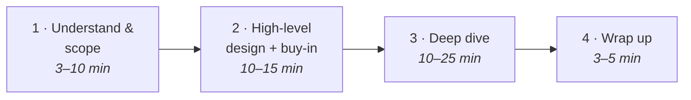
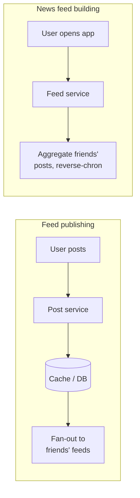

# A framework for system design interviews

"Design Twitter" in 45 minutes sounds absurd — thousands of engineers built the real thing. The good news: **no one expects a real system.** The interview simulates two coworkers tackling an ambiguous, open-ended problem together. There is no perfect answer; the *process* is the product. You're being read for how you collaborate, handle pressure, and resolve ambiguity — and the single most-watched skill is **asking good questions.**

The interviewer is also hunting **red flags**. The big one is **over-engineering** — chasing design purity, ignoring tradeoffs, ignoring cost. Narrow-mindedness and stubbornness round out the list.

## The 4-step process

### Step 1 — Understand the problem and establish scope (3–10 min)

There's a kid named Jimmy who blurts the answer to every question, right or wrong. **Don't be Jimmy.** Jumping straight to a solution is a huge red flag — the interview is not a trivia contest. Slow down and ask:

- What specific features are we building?
- How many users? How fast will it scale — in 3 months, 6 months, a year?
- What's the existing tech stack? What can we reuse?

When you ask, the interviewer either answers or says "make an assumption" — in which case **write the assumption down**, you'll need it. For "design a news feed," good clarifying questions surface: mobile or web (both), key features (post + see friends' feed), sort order (assume reverse-chronological), friends per user (5000), traffic (10M DAU), media or text (both).

### Step 2 — Propose a high-level design and get buy-in (10–15 min)

Build a blueprint *with* the interviewer — treat them as a teammate; many love to get involved.

- Draw box diagrams: clients, APIs, web servers, data stores, cache, CDN, message queue.
- Do back-of-the-envelope math to check the blueprint fits the scale. Think out loud.
- Walk a few concrete use cases — they expose edge cases you missed.

Whether to include API endpoints and DB schema **depends on the problem** — too low-level for "design Google search," fair game for a poker backend. Ask. For the news feed, you'd split into two flows: **feed publishing** (a post is written to cache/DB and fanned into friends' feeds) and **news feed building** (aggregate friends' posts in reverse-chronological order).

### Step 3 — Design deep dive (10–25 min)

By now you've agreed on scope, sketched the blueprint, gotten feedback, and have hints about where to focus. Prioritize components *with* the interviewer — every interview is different. A senior candidate might be steered toward bottlenecks and resource estimates; usually they want you to dig into a component or two. Good deep dives: the **hash function** for a URL shortener; **latency and online/offline status** for a chat system.

**Manage time.** It's easy to rat-hole on minutiae (don't lecture on Facebook's EdgeRank algorithm) that burn minutes without proving you can build something scalable.

### Step 4 — Wrap up (3–5 min)

- Identify **bottlenecks** and improvements — never claim the design is perfect; there's always something.
- Give a quick **recap**, especially if you offered multiple solutions.
- Talk **error cases** (server failure, network loss) and **operations** (monitoring, metrics, rollout).
- Discuss the **next scale curve**: what changes to go from 1M to 10M users?

## Dos and Don'ts

| Do | Don't |
|---|---|
| Always ask for clarification | Jump in without clarifying requirements |
| Understand the requirements first | Assume your assumption is correct |
| Communicate — think out loud | Think in silence |
| Suggest multiple approaches | Over-engineer for design purity |
| Design the most critical components first | Go too deep on one component early |
| Ask for hints when stuck | Believe you're done before the interviewer says so |

There is no right answer — a young startup's solution differs from an established company's. The fit-to-requirements *is* the answer, and the conversation is the signal.
