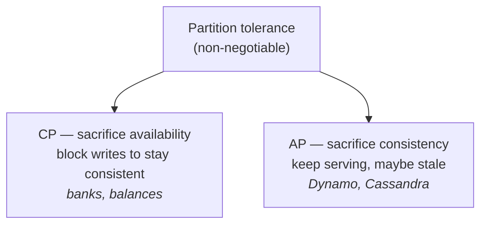
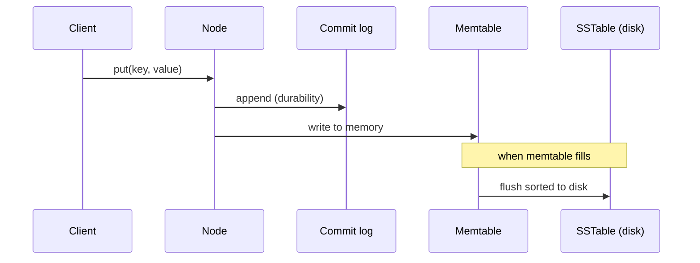
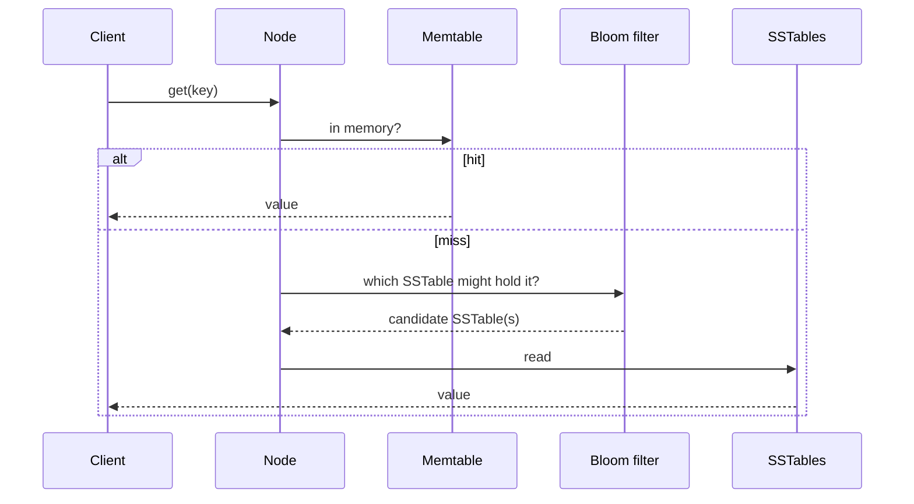

# Design a key-value store

A key-value store is a non-relational database: a unique **key** maps to an opaque **value** (string, list, blob), reached only through `get(key)` and `put(key, value)`. Short keys are faster. A single-server version is just an in-memory hash table — easy, but it hits a memory ceiling fast even with compression and disk spillover. To hold big data with high availability, you go **distributed**, and that drags in the hard tradeoffs.

## CAP theorem: pick two

A distributed system can guarantee at most **two** of: **C**onsistency (every client sees the same data), **A**vailability (every request gets a response even if nodes are down), **P**artition tolerance (it keeps working despite a network split). Since networks *will* partition, a real system must keep P — so the live choice is **CP vs AP**.

When `n3` is partitioned from `n1`/`n2`: a **CP** store blocks writes until the split heals (correct, but unavailable); an **AP** store keeps accepting reads and writes and reconciles `n3` later (available, but briefly stale).

## Quorum: tuning N, W, R

Replicate each key to **N** nodes (walk clockwise on the consistent-hash ring, pick the first N *unique* servers). Then a coordinator enforces a quorum:

- **W** = write quorum — a write needs *W* acks to count as success.
- **R** = read quorum — a read waits for *R* responses.

The key inequality: **if `W + R > N`, you get strong consistency** — the read and write sets must overlap on at least one node holding the newest value.

| Config | Result |
|---|---|
| `R = 1, W = N` | Fast reads, slow writes |
| `W = 1, R = N` | Fast writes, slow reads |
| `W + R > N` (e.g. N=3, W=R=2) | Strong consistency |
| `W + R ≤ N` | No strong-consistency guarantee |

Most AP stores instead pick **eventual consistency**: accept concurrent writes, let conflicting versions exist, and reconcile on read.

## Reconciling conflicts: vector clocks

A **vector clock** tags a value with `[server, version]` counters: `D([Sx, 2], [Sy, 1])`. Writing on server `Si` increments `Si`'s counter (or creates `[Si, 1]`). Version **X is an ancestor of Y** (no conflict — Y wins) if *every* counter in X is ≤ the matching counter in Y. If any counter in X exceeds Y's, they're **siblings** — a real conflict the client must resolve. Downsides: clients carry merge logic, and the `[server:version]` list can grow (cap its length, drop the oldest pairs).

## Failures, then the read/write paths

- **Detection** — **gossip protocol**: nodes swap heartbeat counters with random peers; a counter that stops climbing marks a node down without all-to-all chatter.
- **Temporary failure** — **sloppy quorum + hinted handoff**: a healthy node covers for a down one and hands the data back on recovery.
- **Permanent failure** — **anti-entropy with Merkle trees**: compare root hashes, descend only into mismatched buckets, so sync traffic is proportional to the *difference*, not the dataset.

The storage paths (modeled on Cassandra) are where the diagrams earn their keep:

The **bloom filter** is the trick on the read path: it cheaply rules out SSTables that *can't* contain the key, so you avoid scanning every file on disk.
