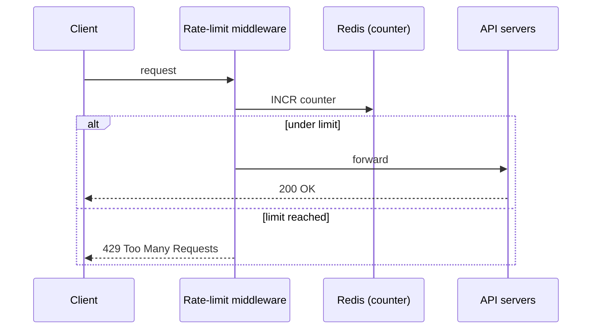
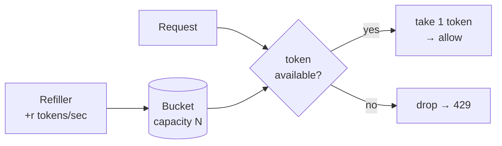

# Design a rate limiter

A rate limiter caps how many requests a client may send in a window — "no more than 2 posts/second", "10 accounts/day per IP". Exceed the threshold and the excess calls are **blocked** (HTTP **429 Too Many Requests**). Why bother? It stops DoS attacks from starving resources, **cuts cost** when you pay per call to a downstream API, and shields servers from overload by bots or misbehaving clients.

## Where does the limiter live?

Not on the client — client code is forgeable and outside your control. It goes server-side, usually as **middleware** in front of your API servers, or inside an **API gateway** (a managed layer that already does SSL termination, auth, IP allow-listing). Build your own only if you have the engineering budget and need full control of the algorithm; otherwise lean on the gateway.

The counter lives in an **in-memory store like Redis**, not a database — disk is too slow on the hot path. Redis gives you two perfect primitives: `INCR` (bump the counter) and `EXPIRE` (auto-delete it when the window ends).

## The five algorithms

| Algorithm | Idea | Strength | Weakness |
|---|---|---|---|
| **Token bucket** | Bucket of capacity *N*, refilled *r* tokens/sec; each request spends one | Allows short **bursts**; simple, memory-efficient | Two params (size, rate) are fiddly to tune |
| **Leaking bucket** | FIFO queue drained at a fixed rate | Smooth, stable outflow | Old requests in the queue can starve fresh ones |
| **Fixed window counter** | One counter per clock-aligned window | Easy, memory-cheap | **Edge burst**: 2× the limit can slip through across a boundary |
| **Sliding window log** | Store every request timestamp; drop those outside the window | Perfectly accurate | Memory-heavy (stores even rejected timestamps) |
| **Sliding window counter** | Hybrid: current window + weighted previous | Smooths spikes, memory-efficient | Approximate (assumes even spread) |

Token bucket is the workhorse — Amazon and Stripe both use it. The fixed-window edge problem is worth knowing: with a 5/min limit, five requests at 2:00:30 and five at 2:01:00 means **ten requests inside the rolling minute 2:00:30–2:01:30**.

## Making it work distributed

One server is easy; many servers concurrently hitting one counter are not. Two problems:

- **Race condition.** Two requests read counter = 3, both compute 4, both write 4 — but the true value is 5. Naive locks fix it but kill throughput; the real fixes are **Redis Lua scripts** (atomic read-modify-write) or **sorted sets**.
- **Synchronization.** With a stateless web tier, a client's requests can land on *different* limiter instances, and instance 1 knows nothing about what instance 2 counted. Sticky sessions "solve" it but aren't scalable — instead, keep all counters in a **centralized store** (Redis) every instance shares.

For latency, run limiters at multi-region **edge** locations and synchronize with an **eventual-consistency** model. And monitor: too-strict rules drop valid traffic; an algorithm that buckles under a flash sale should switch to token bucket, which tolerates bursts.
