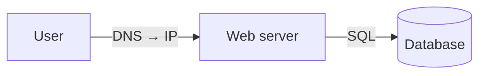
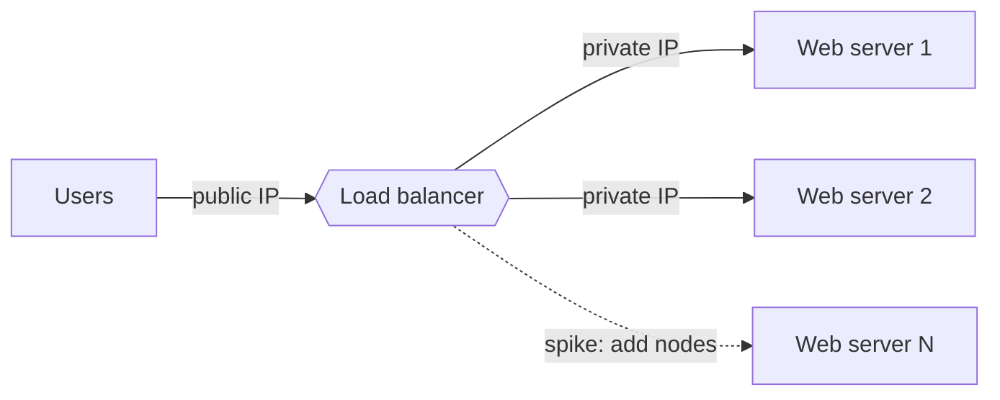
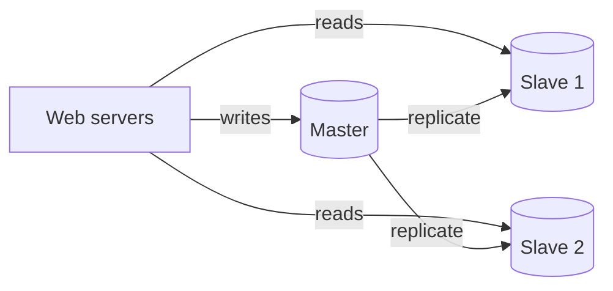
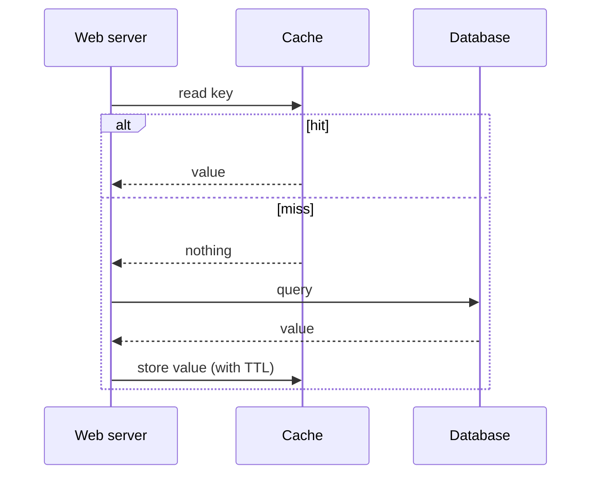
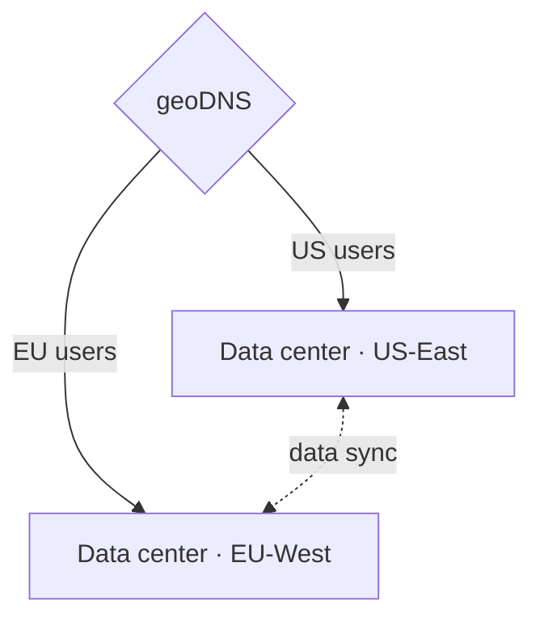
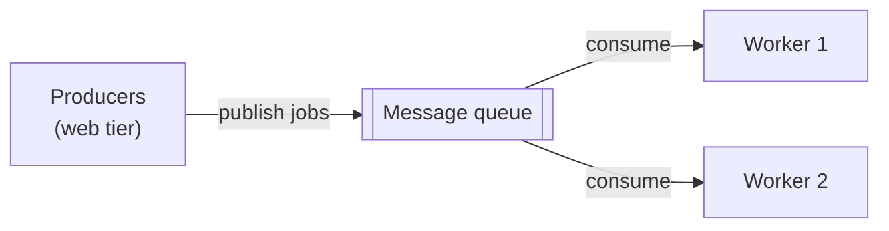
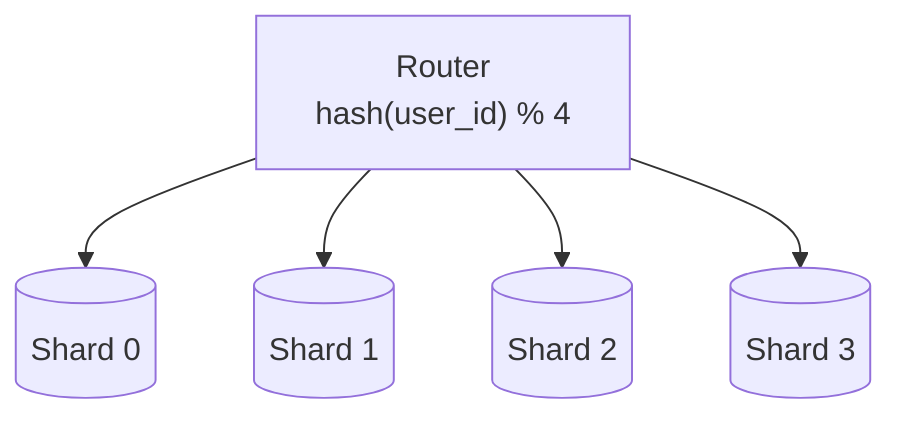

# Scale from zero to millions of users

One server runs everything — web app, database, cache. It works, until it doesn't. The whole craft of system design is the sequence of moves you make as load grows, and each move solves *one specific failure* of the move before it. Memorize the ladder, because interviewers expect you to climb it on demand.

## The single server, and its first crack

At the start, a user hits `api.mysite.com`, DNS returns an IP, HTTP requests flow to your one box, and it returns HTML or JSON. Fine. The **first move** is to split the web tier from the data tier — two boxes instead of one — so each can scale independently. Nothing is faster yet; you've just made future scaling *possible*.

Pick a database here: **relational (SQL)** is the default after 40 years of proving itself. Reach for **NoSQL** only with a reason — super-low latency, unstructured data, massive volume, or you just serialize/deserialize blobs.

## Vertical vs horizontal: the fork in the road

| | Vertical ("scale up") | Horizontal ("scale out") |
|---|---|---|
| Move | Add CPU/RAM to one box | Add more boxes |
| Ceiling | Hard hardware limit | Effectively none |
| Failover | None — box dies, site dies | Survives a node loss |
| Best for | Low traffic, simplicity | Large-scale apps |

Vertical is simplest but has no redundancy and a hard ceiling. Real scale goes horizontal — which forces the next three moves.

## The moves, each fixing the last one's flaw

- **Load balancer** — users hit the LB's public IP; web servers sit behind private IPs. Fixes the single-web-server SPOF: server 1 dies, traffic flows to server 2; traffic spikes, add servers to the pool.

- **Database replication** — one master takes writes, multiple slaves serve reads (reads ≫ writes, so slaves outnumber masters). Fixes the single-DB SPOF and boosts read throughput. If the master dies, a slave is promoted (messier in production — a slave may lag and need recovery scripts).

- **Cache** — an in-memory tier in front of the DB. On a read, check cache first (a **read-through** cache); hit → return, miss → query DB, store, return. Use it for read-heavy, write-light data. Watch the gotchas: **expiration policy** (too short thrashes the DB, too long serves stale), **consistency** (cache and DB updates aren't one transaction), and SPOF — run multiple cache servers.

- **CDN** — geographically dispersed servers caching *static* content (images, CSS, JS, video). First request fills the CDN from origin with a TTL; later requests are served from the edge nearest the user. Plan for cost, sane TTLs, and CDN-failure fallback to origin.

## Stateless web tier — the prerequisite for auto-scaling

A **stateful** server remembers a client between requests (session in local memory) — so every request must be pinned to the *same* server via sticky sessions. That makes adding, removing, and failing-over servers painful. The fix: move session state into a shared store (Redis/NoSQL/DB) so **any** server can handle **any** request. A **stateless** web tier is the thing that finally makes auto-scaling — adding/removing boxes by traffic load — actually work.

## Going wide: data centers, queues, observability

- **Multiple data centers** — geoDNS routes users to the nearest one; an outage reroutes 100% of traffic to a healthy DC. The hard part is **data synchronization** (replicate across DCs) plus multi-site test and deploy.

- **Message queue** — a durable buffer for async work. Producers publish; consumers process later; the two scale independently. Photo-processing jobs, emails, anything slow → push to the queue, let workers drain it. Decoupling is what keeps the system resilient when one side is slow or down.

- **Logging, metrics, automation** — non-negotiable at scale: centralized logs, host/aggregate/business metrics, and CI/CD automation.

## Scaling the data tier: sharding

When one DB can't hold the data, **shard** it: split rows across servers that share a schema but hold disjoint data. Route with a **sharding key** (e.g. `user_id % 4`) — choose it to spread data *evenly*. The three sharding headaches:

- **Resharding** — a shard fills up or grows unevenly; you must change the hash and move data. (Consistent hashing, Ch.5, tames this.)
- **Celebrity / hotspot key** — Katy Perry, Bieber, and Gaga all land on one shard and it melts under reads. Give hot keys their own shards.
- **Joins** — cross-shard joins are hard; **de-normalize** so queries hit one table.

## The summary worth memorizing

Keep the web tier **stateless** · build **redundancy** at every tier · **cache** aggressively · support **multiple data centers** · host static assets in a **CDN** · scale the data tier by **sharding** · split tiers into **services** · **monitor** and automate. That's the zero-to-millions ladder — and the spine of nearly every design that follows.
