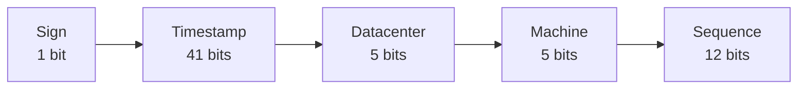

# Unique ID generator in distributed systems

A database's `auto_increment` primary key is the instinct — and it fails in a distributed setting: one DB server doesn't scale, and coordinating an incrementing counter across many databases with low latency is painful. The requirements that frame this problem: IDs must be **unique**, **numeric**, fit in **64 bits**, and be **ordered by time** (created later ⇒ larger), at **10,000+ IDs/sec**.

## Four options, and why Snowflake wins

| Option | How | Why it falls short |
|---|---|---|
| **Multi-master replication** | Each DB increments by *k* (= #servers) instead of 1 | Doesn't scale across data centers; IDs not time-ordered across servers; brittle when servers change |
| **UUID** | 128-bit value generated independently per server | 128 bits (need 64); **not sortable by time**; can be non-numeric |
| **Ticket server** | One central DB owns the `auto_increment` | **Single point of failure**; HA needs multiple servers → sync problems |
| **Twitter Snowflake** | Compose a 64-bit ID from sections | ✅ unique, numeric, 64-bit, time-sortable, no coordination |

UUIDs are tempting because they need **zero coordination** between servers — but they break the 64-bit and time-sortable requirements, so they're out.

## The Snowflake layout

Snowflake's insight is **divide and conquer**: don't generate an ID atomically, build it from independent fields packed into 64 bits.

- **Sign — 1 bit.** Always 0, reserved.
- **Timestamp — 41 bits.** Milliseconds since a *custom epoch*. Because it's the **high-order** field, IDs sort chronologically. 41 bits ≈ `2^41` ms ≈ **69 years** before overflow; a recent custom epoch buys those 69 years from today.
- **Datacenter ID — 5 bits** → `2^5 = 32` data centers.
- **Machine ID — 5 bits** → 32 machines per data center.
- **Sequence — 12 bits** → `2^12 = 4096` IDs per **millisecond per machine**, reset to 0 each millisecond.

Datacenter and machine IDs are fixed at startup (an accidental change risks collisions); timestamp and sequence are computed live. Putting the timestamp first is the whole reason the IDs are sortable — flip the field order and you lose it.

## What to mention if time allows

- **Clock synchronization** — the design assumes synced clocks; across cores/machines that's not guaranteed. NTP is the usual answer.
- **Section tuning** — fewer sequence bits and more timestamp bits suit low-concurrency, long-lived systems.
- **High availability** — an ID generator is mission-critical infrastructure, so it must not be a single point of failure.
