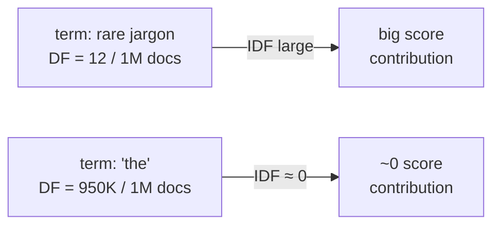

# BM25: the substrate SIRA programs

SIRA doesn't replace BM25 — it makes the LLM *program* BM25. To see why that's a
good trade, you need to know what BM25 already gets right, and what it's missing.

## The formula, in two interpretable pieces

For a query `q = (q1, ..., qn)` and document `d`, BM25 scores `d` by summing a
per-term contribution (Section 2, Eq. 1):

```
BM25(q, d) = Σ IDF(qᵢ) · f(qᵢ,d) / ( f(qᵢ,d) + k₁·(1 - b + b·|d|/avgdl) )
```

> "The formula decomposes into two interpretable factors." — Section 2

- **`IDF(qᵢ)`** — inverse document frequency. A query term that appears in
  almost every document contributes **near-zero** weight; a term that appears in
  only a handful of documents gets a **large** weight. SIRA's paper calls this
  out directly:

  > "It naturally rewards rare, discriminative terms via IDF weighting, so
  > domain-specific jargon that would be diluted in a dense embedding becomes a
  > powerful retrieval signal." — Section 1

- **The TF-saturation term** — `f(qᵢ,d) / (f(qᵢ,d) + k₁·(...))`. Repeating a
  query term inside a document gives **diminishing returns**, controlled by
  `k₁`. The `b` parameter controls how much document length matters: at `b=1`
  the score fully normalizes for `|d|` vs. the corpus average `avgdl`; at `b=0`
  document length is ignored entirely.



*Two terms, same query, very different payoff: BM25 already "knows" that rare
terms are the ones worth matching on — it just has no way to generate them.*

## Why this matters for an LLM-driven agent: it's all index-visible

BM25 runs over an **inverted index** — a map from each vocabulary term to the
documents and frequencies where it appears. That structure means corpus contrast
is something an agent can *look up before retrieving*:

> "Before retrieval, an agent can check whether a candidate term appears in the
> corpus, how many documents contain it, and how much IDF weight it can
> contribute. These signals do not reveal answer passages, but they expose
> whether LLM-proposed vocabulary is absent, too common, or likely to create
> retrieval margin." — Section 2

Compare that to a dense retriever: a query embedding goes straight into
nearest-neighbor search over an opaque vector index. There's no equivalent
"check before you commit" step — you can't ask a dense index "how rare is this
direction in embedding space?" the way you can ask an inverted index "how many
documents contain this term?"

## What BM25 is missing — and what SIRA adds

BM25 is transparent, auditable, and already biased toward the *kind* of term that
wins (rare, discriminative). What it can't do on its own is **generate** those
terms when the query doesn't already contain them:

> "The missing ingredient has been a mechanism to surface the right rare terms
> and constraints; LLMs, with their vast parametric knowledge, are uniquely
> positioned to fill this role." — Section 1

That's the seam SIRA builds on: an LLM proposes candidate vocabulary, the
inverted index's document-frequency statistics validate (or reject) each
candidate *before* it ever touches a query, and the surviving terms get scored by
the same IDF-weighted formula above. The next lesson covers exactly how.
