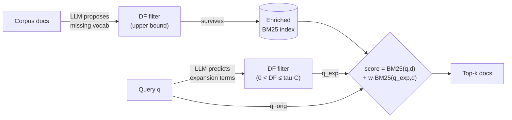

# The two-stage enrichment pipeline

## One-shot, from both sides at once

> "SIRA replaces this multi-round loop with a one-shot pipeline that bridges the
> vocabulary gap between queries and documents from both sides
> simultaneously... The full system requires no training, no relevance labels,
> and no supervised query–document pairs; it operates with a frozen LLM and
> corpus statistics alone." — Section 3.1

"Both sides" means: the **corpus** is missing the vocabulary a user would search
with, and the **query** is missing the vocabulary the answer document would use.
SIRA enriches each side once, in a different rhythm — corpus-side offline and
amortized across every future query, query-side online and per-query.



*(Figure 2 — corpus-side enrichment (top path) runs once, offline; query-side
enrichment (bottom path) runs per query; both feed a single weighted BM25 call.)*

## Corpus-side: teach the index the vocabulary it's missing

For each document, a frozen LLM is asked to anticipate *how a user would search
for it* — using words the document itself doesn't contain:

> "The prompt explicitly instructs the LLM to generate **new** terms not already
> present in the document, focusing on discriminative vocabulary: synonyms,
> abbreviations, alternate names, and domain-specific phrasings that maximize
> lexical contrast with existing index terms." — Section 3.2

Every proposed term still has to earn its place. The shared **DF filter**
enforces an upper bound:

> "The filter enforces an upper bound DF ≤ τ·|C|, pruning terms that are repeated
> across too much of the corpus and therefore receive little useful IDF
> weight." — Section 3.2

Terms that survive are decomposed into sliding-window n-grams and written into
the index as new posting-list entries — this happens once per corpus, so its cost
is amortized over every query that follows.

## Query-side: predict what the answer document would say

At query time, the same trick runs in reverse. The LLM produces an
**expected-response sketch** — concepts, entities, and discriminative terms it
expects a *relevant document* to contain, that the *query* doesn't:

> "The prompt instructs the LLM to generate discriminative topic and domain
> vocabulary that narrows the search space, while explicitly forbidding it from
> guessing the answer itself." — Section 3.2

That last clause matters. For a factoid question, letting the LLM guess the named
entity it thinks is the answer would bias retrieval toward one candidate instead
of broadening coverage. The sketch is a *prior over vocabulary*, not a guess at
the answer.

The same DF filter grounds this sketch — but query-side adds a second condition:

> "For query-side enrichment, the filter additionally requires DF > 0, ensuring
> that every expansion phrase actually exists in the enriched index and can
> affect BM25 scoring. Corpus-side enrichment does not require this lower bound,
> since enrichment itself introduces new vocabulary into the index." — Section 3.2

So: corpus-side enrichment can *create* new vocabulary (only an upper bound);
query-side enrichment can only *point at* vocabulary that's already there (upper
**and** lower bound).

## The retrieval program: one weighted BM25 call

Whatever survives the query-side filter becomes `q_exp`, and SIRA fires a single
retrieval call combining it with the original query (Eq. 2):

```
score(d) = BM25(q_orig, d) + w · BM25(q_exp, d)
```

The original query is never discarded — `q_exp` only *adds* discriminative
signal on top of it, weighted by `w`. One LLM reasoning step, optional
index-statistic checks, one BM25 call — that's the entire retrieval action.
