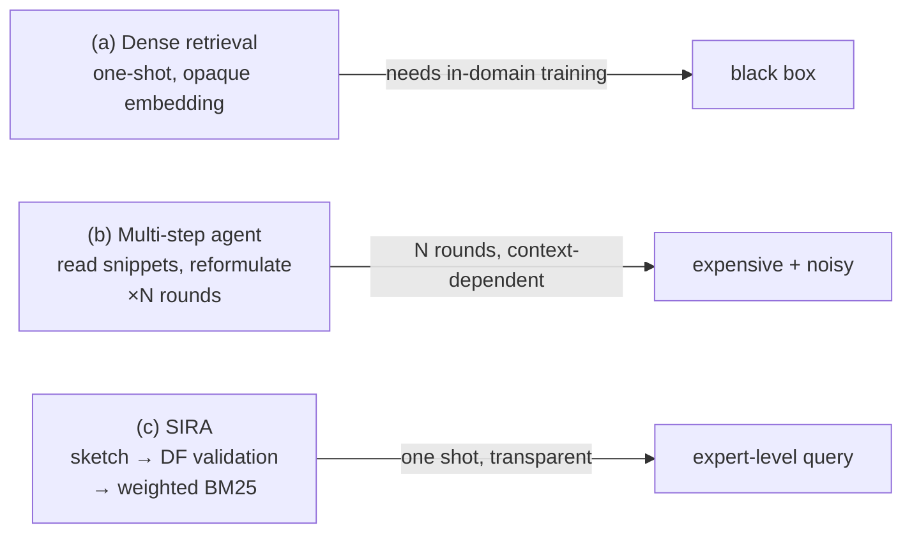

# Retrieval agents that search like newcomers

## The black box at the center of agentic retrieval

Most retrieval-augmented agents treat the search engine as a black box: issue a
query, inspect the snippets that come back, reformulate, and repeat until
something useful shows up.

> "This resembles how a newcomer searches an unfamiliar database rather than how
> an expert navigates it with strong priors about terminology, constraints, and
> likely evidence, leading to unnecessary retrieval rounds, increased latency, and
> poor recall." — Abstract

An expert doesn't explore their way to the answer — they walk in already knowing
the jargon, the synonyms, and the constraints that will separate the right
document from a sea of plausible-looking distractors.

## The hidden cost: the "retrieval-context advantage"

Why do today's search agents work at all, if retrieval itself is a black box?
Because they cheat — productively. Each round of search dumps snippets, entity
names, and near-misses into the LLM's context, and the *next* query is written
with all of that accumulated evidence in view.

> "The agent compensates for weak retrieval control by learning the corpus
> through interaction. This strategy is expensive and noisy, and it relies
> increasingly on long-context LLMs to retain and use many intermediate
> passages — a regime known to be unreliable when relevant evidence is buried in
> long contexts." — Section 1

So the failure mode isn't that the LLM can't reason. It's that **the search
interface gives it too little direct control**, so it's forced into hit-and-miss
exploration and has to pay for that exploration with context tokens, latency, and
extra round trips.

## Reframing the problem: retrieval is a ranking contest, not a relevance check

Classical IR theory names the part of the problem agentic systems usually skip:

> "Retrieval is not just a question of whether a query is semantically related to
> the desired document; it is a comparative ranking problem in which the gold
> evidence must outrank many non-gold confusers." — Section 1

A query can be *plausible* — clearly about the right topic — and still fail,
because the terms it uses also match thousands of distractors, or because the
terms an expert would use (the ones that would actually separate the gold
document from the crowd) never appear in the query at all.

## SIRA's bet: compress the search into one expert move

SIRA — the **Superintelligent Retrieval Agent** — defines "superintelligence in
retrieval" as a four-step compression of the entire multi-round process into a
single action:

> "(i) form a domain-informed expectation of what relevant evidence looks like,
> (ii) ground that expectation using lightweight index-aware signals (document
> frequency), (iii) compile the result into explicit retrieval controls, and (iv)
> execute retrieval efficiently and transparently." — Section 1

*(Figure 1 — three retrieval paradigms. (a) and (b) both either need supervision
or accumulate context across rounds; (c) is the one path that's both one-shot
**and** transparent.)*

The crucial detail in (c): SIRA's "expectation" is just a *prior* — a sketch of
likely terms. Before that sketch becomes a query, it gets checked against the
corpus's own statistics (document frequency), so the final query isn't merely
*plausible* — it's *discriminative* for this specific corpus.

## What this buys, in one sentence

> "These results suggest that the bottleneck in retrieval-augmented agents is not
> the sophistication of the reader or the number of search iterations, but the
> agent's ability to construct an expert-level, corpus-discriminative retrieval
> action." — Section 1
