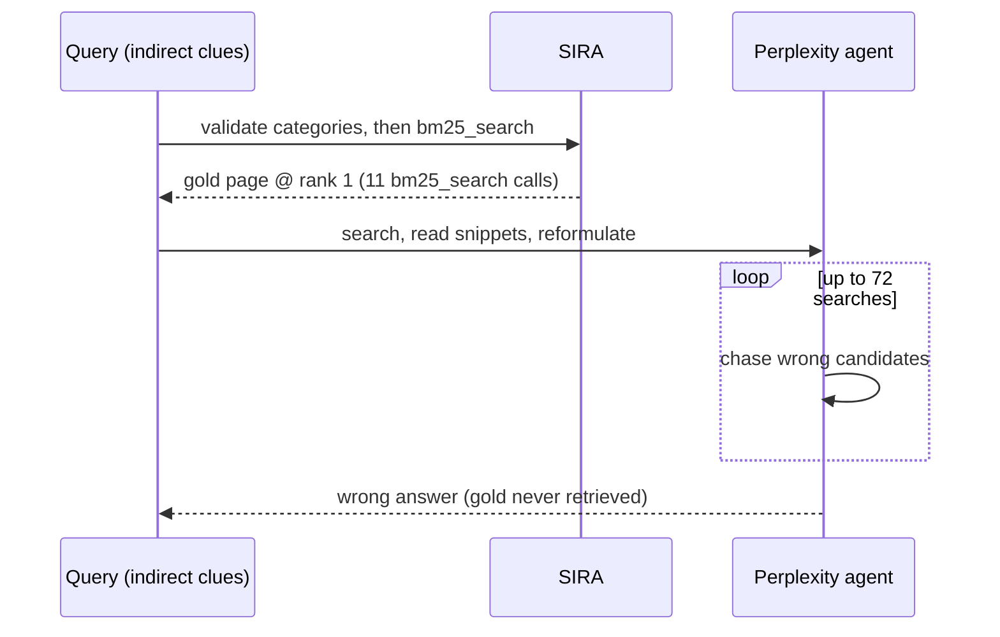

# What SIRA buys you: BEIR, QA, and BrowseComp-Wikipedia

SIRA is evaluated in three increasingly demanding settings: pure retrieval
(BEIR), downstream question answering (NQ, HotpotQA), and hard agentic search at
Wikipedia scale (BrowseComp-Wikipedia).

## RQ1: training-free SIRA beats trained retrievers on BEIR

Across ten BEIR benchmarks (Table 2), averages for Recall@10 / NDCG@10:

| System | Recall@10 | NDCG@10 |
|---|---|---|
| BM25 | 0.530 | 0.425 |
| SPLADE (learned sparse) | 0.625 | 0.522 |
| E5 (dense, supervised) | 0.648 | 0.543 |
| Search-R1 (E5 backend, RL-trained) | 0.616 | 0.522 |
| GrepRAG / ShellAgent (grep-style agents) | 0.280 / 0.253 | 0.209 / 0.169 |
| **SIRA** | **0.691** | **0.572** |

> "SIRA achieves the highest average Recall@10 on BEIR... without relevance
> labels, without fine-tuning a retriever, and without building an embedding
> index." — Section 4.2

The win is broad, not a one-dataset fluke — best Recall@10 on **8 of 10**
benchmarks (the exceptions: Search-R1(E5) edges ahead on NQ by 0.06pp, E5 edges
ahead on Quora by 0.4pp). The *largest* gains over E5 land where query and
document vocabulary diverge most: **+36% relative on SciDocs, +23% on
CQADupStack, +14% on ArguAna** — exactly the settings where "the LLM proposes
missing terminology, the DF filter removes absent or overly common terms, and
BM25 amplifies the surviving discriminative vocabulary."

## RQ2: the gap isn't the LLM — it's the retrieval interface

GrepRAG and ShellAgent share SIRA's exact LLM backbone (Qwen3.6-35B-A3B-FP8) but
treat retrieval as pattern generation instead of corpus-aware ranking:

> "Because the backbone is shared, the gap isolates the retrieval interface:
> grep-style agents search with patterns that lack BM25's document-frequency and
> IDF-weighted term scoring, while SIRA turns LLM proposals into weighted
> retrieval signals. SIRA therefore outperforms GrepRAG and ShellAgent by 41.0
> and 43.8 absolute Recall@10 points." — Section 4.2

Search-R1 tells a similar story from the other direction: giving an RL-trained
search *policy* a strong E5 backend lifts it to 0.616 Recall@10 — still short of
SIRA's 0.691. More search rounds on top of a good retriever don't close the gap;
*programming* the retriever does.

## RQ3: retrieval-only SIRA beats RL-trained QA agents

On NQ and HotpotQA, SIRA contributes **only retrieved passages** — no reader, no
RL fine-tuning, no multi-round search — yet its *answer coverage* (does the gold
answer string appear in the retrieved text?) beats the *end-to-end accuracy* of
six RL-trained agentic QA systems (Figure 3):

| | NQ | HotpotQA |
|---|---|---|
| Best RL-trained baseline (HiPRAG / E-GRPO) | 71.2% | 69.0% |
| SIRA, top-5 | 80.4% | 73.1% |
| **SIRA, top-10** | **84.7%** | **77.6%** |

> "For corpus-grounded QA, improving retrieval can be more important than adding
> more search rounds or training the answer generator." — Section 4.3

## BrowseComp-Wikipedia: one-shot vs. 100 turns of browsing

BrowseComp-Wikipedia grounds 232 hard BrowseComp-style queries in a
**25,587,229-document** English Wikipedia index. Here SIRA runs *without*
index-time LLM enrichment — its only corpus-side structure is Wikipedia's own
category graph, with every proposed category validated against it before use.
The baseline is a Perplexity-search agent allowed to browse for **up to 100
turns**, reading snippets and reformulating after each one.

| System (backbone: Claude 4.6 Opus) | Recall@1 | Recall@10 | Recall@100 |
|---|---|---|---|
| Perplexity (≤100 turns) | 2.59% | 4.74% | 32.33% |
| **SIRA** (one shot, category-grounded) | **9.70%** | **15.27%** | **36.14%** |

SIRA more than **triples** the best Perplexity Recall@1 and more than **doubles**
its Recall@10 — the gains are largest exactly where they matter most for an
agent's reader: getting the right page into a *small* context.

### Case study: 11 calls vs. 72 searches

Figure 5 traces a single query (gold page: *LocoRoco*, deliberately indirect —
clues about a 2005 release date, a designer's birth year, a composer's birth
month):

SIRA grounds each clue (release window, designer's nationality and birth decade,
composer's birth year) into category-anchored BM25 calls and lands the gold page
at rank 1. Perplexity issues 72 distinct web searches, cycles through plausible
but wrong candidates (Persona 3's director, then a *Painkiller* composer), and
never surfaces *LocoRoco* at all.

> "Hard search is not only about having a powerful LLM or a strong commercial
> search engine, but about constructing the right corpus-grounded retrieval
> action." — Section 4.4
