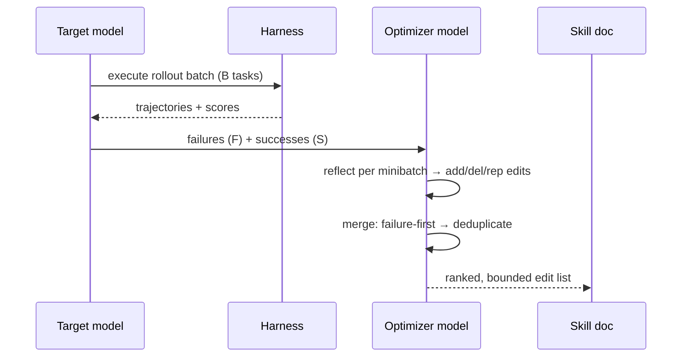
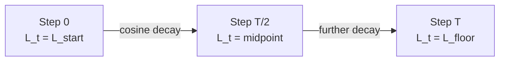

# The Optimization Loop

## Forward pass: rollout evidence

At each optimization step, the target model runs a **rollout batch** from the training split D_tr with the current skill. The harness records every task's messages, tool calls, intermediate outputs, final answers, and verifier scores — the raw evidence the optimizer model will read.

Small batches update quickly but noisily. Larger batches expose recurring patterns before the skill changes. SkillOpt also supports **accumulation** — multiple rollout batches reflected on separately, then merged into one update — decoupling execution throughput from update frequency.

## Backward pass: minibatch reflection

The optimizer model receives the batch and splits it into **failures** and **successes**, then partitions each into **reflection minibatches**:

> "Single trajectories often produce anecdotal fixes, while minibatches expose reusable procedural errors: the agent consistently searches the wrong source, writes an answer in the wrong format, or fails to verify a tool result." — *Section 3.3*

Each reflection returns structured `add`, `delete`, or `replace` edits. Local proposals are then **merged hierarchically**: failure-driven corrections first (missing or corrective rules), success-driven preservation second (behaviors that already work). This step filters duplicates and contradictions before ranking.

## Bounded text updates: the learning rate analogue

After merging, the optimizer ranks the edit pool by expected utility and clips it to the top **L_t edits**. L_t is the **edit budget** — SkillOpt's direct analogue of a learning rate.

> "Unbounded rewrites can erase useful rules, introduce incompatible instructions, or overfit to a local failure; bounded updates preserve continuity while still allowing the skill to acquire new procedures." — *Section 3.4*

SkillOpt supports four schedules: constant, linear, cosine, and autonomous. The **default cosine schedule** starts with a larger edit budget and decays toward a floor:

The formula: L_t = L_floor + (L_start − L_floor) × 0.5 × (1 + cos(π × step / totalSteps))

The selected edits produce a **candidate skill S_{t+1}**, which goes to the validation gate. Step-level edits cannot overwrite the **protected slow-update field** — the epoch-wise consolidation zone (next lesson) — keeping fast local changes and slower cross-epoch learning structurally separated inside the same document.
