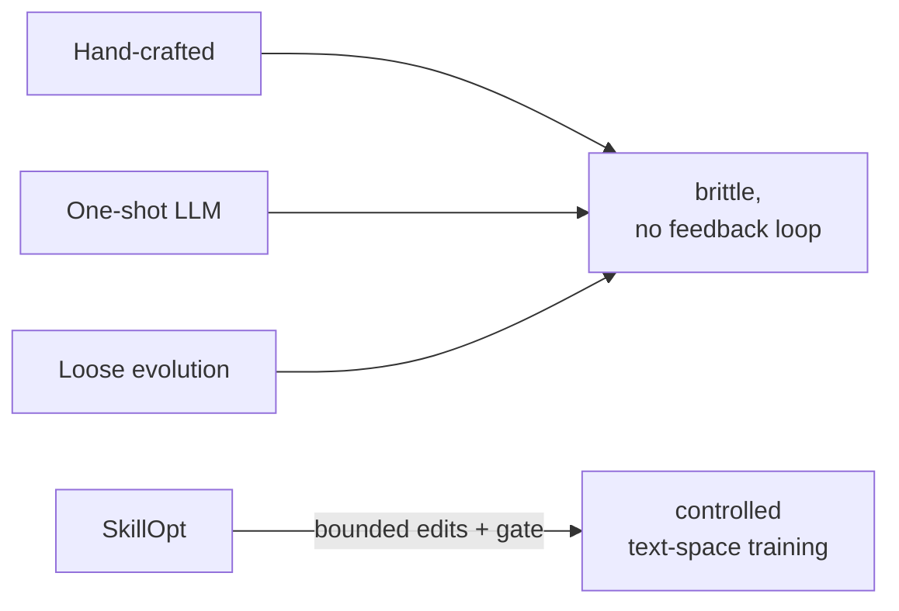
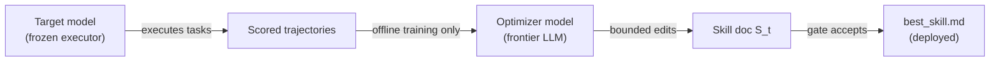

# The Skills Gap

## What a skill is

A **skill** is a portable natural-language document injected into an agent's context before any task: procedures, tool policies, output constraints, domain heuristics, and failure modes — all in plain text. A skill lets a *frozen* target model adapt to a new domain without touching its weights.

> "Agent skills today are hand-crafted, generated one-shot, or evolved through loosely controlled self-revision — none of which behaves like a deep-learning optimizer for the skill, and none of which reliably improves over its starting point under feedback." — *Abstract*

| Strategy | How it's built | What breaks |
|---|---|---|
| Hand-crafted | Expert writes rules once | Brittle under a new domain or harness; can't self-correct |
| One-shot LLM | Single generation from task description | No rollout feedback; first guess is last guess |
| Loosely evolved | Rewrite from failures | Ad hoc: each revision can erase useful rules; no budget, no gate |

All three share the same structural flaw: no principled stopping criterion, no control over step size, no held-out check to confirm a proposed revision actually helps.

## The training analogy

SkillOpt's answer: "treat skill editing as a controllable domain-adaptation process, with the skill document as the external state, an additional frontier model as the optimizer, and training-style controls over evidence, step size, validation, and update direction." — *Section 1*

| DL training | SkillOpt analogue |
|---|---|
| Model weight | Skill document |
| Gradient direction | Trajectory-derived add/delete/replace edit direction |
| Learning rate | Edit budget L_t (max edits per step) |
| Validation set | Held-out selection split D_sel |
| Weight checkpoint | best_skill.md |
| Momentum / slow update | Epoch-wise slow/meta update |

This analogy is "operational rather than decorative" — *Section 1*. The edit budget prevents large jumps; the held-out gate rejects proposals that don't generalize; the epoch-wise update captures long-horizon patterns.

## Two models, two roles

The optimizer model is **training-time only** — it never runs during inference. The deployed artifact is a static `best_skill.md` that adds zero optimizer calls, zero weight changes, and only a compact text block to the target model's context.

The practical pay-off: a high-capacity frontier optimizer can train a reusable skill for a weaker target model. The stronger optimizer pays only training-time API costs; the smaller deployed model gets procedural knowledge it doesn't hold in its weights.
