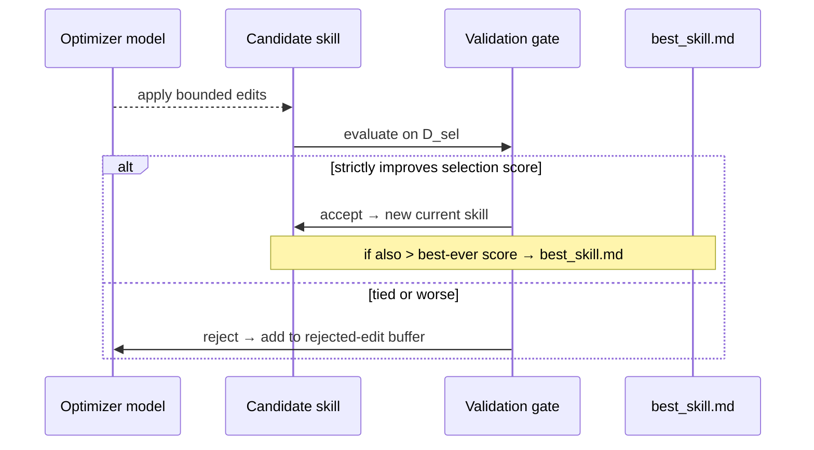

# Stability Mechanisms

## Why bounded edits alone aren't enough

A bounded edit budget prevents *large* jumps, but it can't prevent *wrong* jumps — "plausible textual diagnoses can still hurt the actual target model." — *Section 3.5*

The stability system has three interlocking parts: a validation gate (per-step), a rejected-edit buffer (per-epoch), and a slow/meta update (cross-epoch).

## The validation gate

Every candidate skill S_{t+1} is evaluated on the held-out **selection split D_sel** with the same frozen target model and harness. The update is accepted only if the selection score is **strictly greater** than the current selection score — ties are rejected.

Conservative by design: a proposed edit can read well and still degrade performance. The gate converts "propose and hope" into "propose and test." The strict criterion also makes rejected edits **informative negative feedback** — a rejected edit that didn't cross the threshold is a clear signal that the edit was unhelpful.

## Rejected-edit buffer: negative feedback without deployment cost

Rejected edits are not discarded. The optimizer records an epoch-local buffer containing:
1. Observed failure patterns
2. The specific edits that were tried and rejected
3. The score *drop* each rejected edit caused

Later reflection calls in the same epoch receive this buffer. The optimizer can then avoid repeating failed edits and concentrate on unresolved failures.

> "This gives the loop negative feedback during training without adding inference-time cost." — *Section 3.5*

The buffer resets at epoch boundaries — stale rejection history from a previous epoch shouldn't block corrections that are now warranted under the new current skill.

## Epoch-wise slow/meta update

Step-level edits learn from the current rollout batch. The **slow/meta update** learns from *adjacent epochs*:

1. At the end of each epoch, sample the same training items under the **previous-epoch skill** and the **current skill**
2. Group results into: improvements, regressions, persistent failures, stable successes
3. The optimizer writes a concise **longitudinal guidance block** into the skill's protected `slow_update` field
4. This candidate is still passed through the same validation gate before being accepted

> "Slow update captures durable domain lessons while preserving the same safety check as step-level edits." — *Section 3.6*

**The meta skill** is optimizer-side only: a running summary of which edit patterns helped, which were rejected, and which failure modes persisted across epochs. This guidance is prepended to future optimizer prompts for reflection, merging, and ranking — but it is **never shipped with best_skill.md**.

The advantage: the deployed skill stays compact and portable; training benefits from a richer editing history that accumulates across epochs. A practitioner reading the final `best_skill.md` sees only the validated procedural rules — not the optimizer's internal deliberations.
