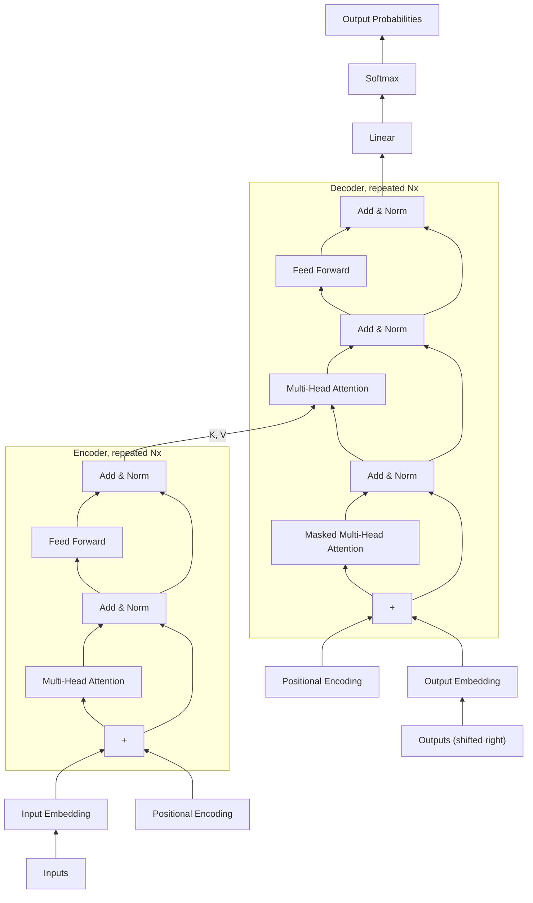

## Two stacks, three sub-layers, one residual trick

If you sat down to design a sequence-to-sequence model with *zero* recurrence, what
would it even need? Something to read the input, something to generate the output,
and — since you no longer get position information for free from "this is the
hidden state after step 3" — some other way to tell the model where each token
sits.

That's exactly the shape the Transformer takes:

> "Most competitive neural sequence transduction models have an encoder-decoder
> structure. Here, the encoder maps an input sequence of symbol representations
> (x1, ..., xn) to a sequence of continuous representations z = (z1, ..., zn). Given
> z, the decoder then generates an output sequence (y1, ..., ym) of symbols one
> element at a time." — *Section 3*

Both halves are stacks of `N = 6` *identical* layers — same structure repeated six
times, with different learned weights at each depth. This is Figure 1 from the
paper, redrawn as a flowchart so it reads the same bottom-to-top way the original
does — inputs and outputs at the bottom, output probabilities at the top:

Every "Add & Norm" box is a residual connection (the sub-layer's output added back
to its input) followed by layer normalization — that's the
`LayerNorm(x + Sublayer(x))` rule the next section quotes directly. Notice the
encoder's final output (labeled `K, V` above) feeds into the decoder's *second*
attention sub-layer, not its first — that's the encoder-decoder attention bridge
covered below.

### The encoder: two sub-layers, repeated six times

Each encoder layer has exactly two pieces: a multi-head self-attention mechanism,
then a position-wise feed-forward network. Around *each* of those two sub-layers
sits a residual connection followed by layer normalization:

> "We employ a residual connection around each of the two sub-layers, followed by
> layer normalization. That is, the output of each sub-layer is
> `LayerNorm(x + Sublayer(x))`... all sub-layers in the model, as well as the
> embedding layers, produce outputs of dimension d_model = 512." — *Section 3.1*

`x + Sublayer(x)` is the same residual-connection trick you'd recognize from
ResNet: instead of forcing each layer to relearn the entire representation from
scratch, the layer only has to learn the *correction* to add to what it received.
With six stacked layers, that's the difference between a usable gradient signal at
layer 1 and one that has vanished by the time it backpropagates that far.

### The decoder: the same two, plus one more, plus a mask

The decoder copies the encoder's two sub-layers, then inserts a third in between:
multi-head attention over the encoder's output. This is the bridge — the only place
information from the input sequence reaches the output side.

> "In addition to the two sub-layers in each encoder layer, the decoder inserts a
> third sub-layer, which performs multi-head attention over the output of the
> encoder stack." — *Section 3.1*

There's one more wrinkle decoders need that encoders don't: at training time the
decoder sees the *entire* target sentence at once (for efficiency), but it must not
be allowed to peek at the answer. Position 5 predicting word 5 cannot be allowed to
look at word 6, 7, or 8 — that would be cheating, since at inference time those
words don't exist yet.

> "We also modify the self-attention sub-layer in the decoder stack to prevent
> positions from attending to subsequent positions. This masking, combined with
> the fact that the output embeddings are offset by one position, ensures that the
> predictions for position i can depend only on the known outputs at positions less
> than i." — *Section 3.1*

> **Wait — if the decoder can't look ahead, how is this still parallel?** The
> *masking* is parallel — it's just zeroing out (setting to −∞ before softmax) the
> illegal connections in one matrix operation, not stepping through positions one at
> a time like an RNN would. You still compute every position's attention scores
> simultaneously; you just discard the disallowed ones.

This masked self-attention is what makes the decoder still auto-regressive (each
output token conditions on the previous ones) without forcing the kind of
sequential, wait-for-the-last-step computation that the whole paper exists to
eliminate.
