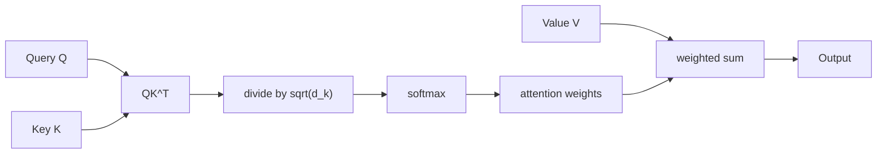

## What does "attention" actually compute?

Strip away the diagrams you've probably seen and attention is a remarkably small
piece of math. The paper's own definition:

> "An attention function can be described as mapping a query and a set of
> key-value pairs to an output, where the query, keys, values, and output are all
> vectors. The output is computed as a weighted sum of the values, where the
> weight assigned to each value is computed by a compatibility function of the
> query with the corresponding key." — *Section 3.2*

Translate that to a search-engine analogy: your **query** is what you're looking
for, every document has a **key** (a summary of what it's about) and a **value**
(its actual content). You score the query against every key, turn those scores
into weights, and your answer is a weighted blend of every document's value —
mostly the relevant ones, a little of everything else.

### Scaled dot-product attention

The Transformer's specific compatibility function is just a dot product, scaled:

> "We compute the dot products of the query with all keys, divide each by √dk, and
> apply a softmax function to obtain the weights on the values." — *Section 3.2.1*

> Attention(Q, K, V) = softmax( Q·Kᵗ / √dₖ ) · V

Why divide by √dk at all? The paper walks through the failure mode directly:

> "We suspect that for large values of dk, the dot products grow large in
> magnitude, pushing the softmax function into regions where it has extremely
> small gradients." — *Section 3.2.1, footnote 4*

If `q` and `k` are random vectors with unit variance per component, their dot
product has variance `dk` — so as the key dimension grows, raw dot products blow up,
softmax saturates toward one-hot, and gradients vanish almost everywhere. Dividing
by √dk keeps the variance roughly constant regardless of dimension, which is the
entire reason for the "scaled" in the name.

### Multi-head attention: why one attention function isn't enough

A single attention computation forces the model to average over *one* notion of
"relevant" per position. The paper's fix is to run several smaller attention
computations in parallel, each with its own learned projection of Q, K, and V:

> "Instead of performing a single attention function with d_model-dimensional
> keys, values and queries, we found it beneficial to linearly project the
> queries, keys and values h times with different, learned linear projections...
> Multi-head attention allows the model to jointly attend to information from
> different representation subspaces at different positions. With a single
> attention head, averaging inhibits this." — *Section 3.2.2*

> MultiHead(Q,K,V) = Concat(head₁, ..., headₕ)·Wᴼ, where headᵢ = Attention(Q·Wᵢᵠ, K·Wᵢᴷ, V·Wᵢᵛ)

The paper uses `h = 8` heads, with `dk = dv = d_model / h = 64`. Note the trick:
splitting one 512-dimensional attention into eight 64-dimensional ones costs about
the *same* total compute as a single full-dimensional head — you're trading one
big averaged view for eight smaller, specialized ones at roughly no extra cost.

### Three different jobs, one mechanism

The Transformer reuses this same multi-head attention block in three structurally
different places:

| Where | Queries come from | Keys/values come from | What it does |
|---|---|---|---|
| Encoder self-attention | previous encoder layer | previous encoder layer | every input position sees every other input position |
| Decoder self-attention (masked) | previous decoder layer | previous decoder layer, masked | each output position sees itself and earlier output positions only |
| Encoder-decoder attention | previous decoder layer | encoder's final output | every output position can look at the entire input sequence |

> "In 'encoder-decoder attention' layers, the queries come from the previous
> decoder layer, and the memory keys and values come from the output of the
> encoder. This allows every position in the decoder to attend over all positions
> in the input sequence." — *Section 3.2.3*

Same formula, three different sources for Q, K, and V — that reuse is what makes
"attention is all you need" literally true: there's no separate mechanism for
"look at my own sequence" versus "look at the other sequence."
