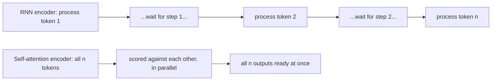

## Why did anyone bother replacing RNNs?

Quick question before the paper answers it for you: if you feed a 50-word sentence
into an RNN, how many sequential steps does the network need before it has even
*seen* the last word?

Fifty. One hidden state at a time, each one waiting on the last:

> "Recurrent models typically factor computation along the symbol positions of the
> input and output sequences... This inherently sequential nature precludes
> parallelization within training examples, which becomes critical at longer
> sequence lengths." — *Section 1*

That's the whole bottleneck in one sentence. It's not that RNNs and LSTMs were bad
at language — by 2017 they were the established state of the art for translation
and language modeling. It's that **training one is inherently a relay race**: step
50 cannot start until step 49 finishes, no matter how many GPUs you own. Attention
mechanisms had already been bolted onto these models to let the decoder "look back"
at any encoder position regardless of distance — but almost always *as an add-on
to* a recurrent backbone, not a replacement for it.

> **Wait — wasn't attention already solving the long-range problem?** Partially.
> Attention let the *decoder* skip straight to a relevant *encoder* position. But the
> encoder and decoder themselves were still RNNs internally — still one state at a
> time, still sequential, still slow to train on long sequences.

### The bet this paper makes

Vaswani et al. propose ripping out the recurrence (and the convolutions some
competing architectures used) entirely, and building the *whole* model — encoder
and decoder both — out of nothing but attention:

> "In this work we propose the Transformer, a model architecture eschewing
> recurrence and instead relying entirely on an attention mechanism to draw global
> dependencies between input and output." — *Section 1*

No per-position hidden state to wait on means every position's representation can
be computed **in parallel**. The trade they're betting on: attention computes a
score between *every pair* of positions, which costs more arithmetic per layer than
a recurrent step — but all of that arithmetic is independent, so it parallelizes
perfectly on a GPU.

The result, from the abstract, is the headline you'll see quoted everywhere:

> "Our model achieves 28.4 BLEU on the WMT 2014 English-to-German translation task...
> On the WMT 2014 English-to-French translation task, our model establishes a new
> single-model state-of-the-art BLEU score of 41.8 after training for 3.5 days on
> eight GPUs, a small fraction of the training costs of the best models from the
> literature." — *Abstract*

Better translations, and dramatically cheaper to train — not despite dropping
recurrence, but *because* of it. The rest of this module is about how a model with
no recurrence and no convolution can still represent a sequence at all, and what
exactly an "attention function" computes.
