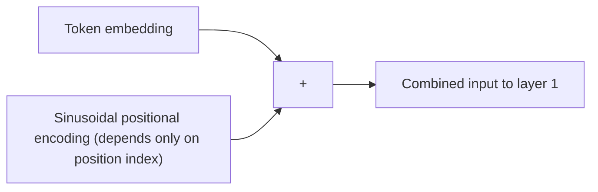

## Two problems left to solve: per-position math, and order

Self-attention answers "who should each position pay attention to," but it leaves
two gaps that recurrence used to fill for free.

### Gap 1: attention mixes positions together — something needs to process each one individually too

Every encoder and decoder layer follows its attention sub-layer with a small,
fully-connected network applied identically to *every* position separately:

> "In addition to attention sub-layers, each of the layers in our encoder and
> decoder contains a fully connected feed-forward network, which is applied to
> each position separately and identically. This consists of two linear
> transformations with a ReLU activation in between." — *Section 3.3*

> FFN(x) = max(0, x·W₁ + b₁)·W₂ + b₂

Input and output are `d_model = 512`-dimensional; the hidden layer in between
expands to `d_ff = 2048` before projecting back down. The paper notes this is
"another way of describing this is as two convolutions with kernel size 1" — it's
not a sequence operation at all, just the same small MLP run independently at
every position, the way you'd apply the same filter to every pixel in an image.

### Gap 2: if there's no recurrence, how does the model know token order?

This is the sharper problem. An RNN gets word order for free — it processes token 1
before token 2 by construction. Self-attention has no such built-in notion: it
treats the input as an unordered *set* of vectors, computing scores between every
pair regardless of who came first. Shuffle the input tokens and, on their own, the
attention scores between any two of them don't change.

> **Wait — doesn't this mean "the cat sat on the mat" and "the mat sat on the cat"
> look identical to the model?** They would, if nothing else were added. That's
> exactly the gap positional encoding exists to close.

The fix: inject a position-dependent signal directly into the input embeddings,
before anything else happens.

> "Since our model contains no recurrence and no convolution, in order for the
> model to make use of the order of the sequence, we must inject some information
> about the relative or absolute position of the tokens in the sequence... The
> positional encodings have the same dimension d_model as the embeddings, so that
> the two can be summed." — *Section 3.5*

The specific function chosen is a bank of sine and cosine waves at different
frequencies, one pair per pair of embedding dimensions:

> PE(pos, 2i) = sin(pos / 10000^(2i/d_model))
> PE(pos, 2i+1) = cos(pos / 10000^(2i/d_model))

Why sinusoids specifically, rather than just learning a position vector per slot
the way you'd learn a word embedding?

> "We chose this function because we hypothesized it would allow the model to
> easily learn to attend by relative positions, since for any fixed offset k,
> PE(pos+k) can be represented as a linear function of PE(pos)... [and] it may
> allow the model to extrapolate to sequence lengths longer than the ones
> encountered during training." — *Section 3.5*

The paper actually tried both — fixed sinusoids and learned position embeddings —
and found them to "produce nearly identical results" on the translation task. They
kept the sinusoidal version for the extrapolation benefit, not because it measurably
outperformed the learned alternative on the benchmark.

### Was dropping recurrence even a good trade, complexity-wise?

Section 4 makes the trade explicit with three numbers per layer type: total
compute, how much of it is forced to run sequentially, and the longest path any
signal has to travel between two positions.

| Layer type | Complexity per layer | Sequential operations | Max path length |
|---|---|---|---|
| Self-attention | O(n²·d) | O(1) | O(1) |
| Recurrent | O(n·d²) | O(n) | O(n) |
| Convolutional | O(k·n·d²) | O(1) | O(log_k(n)) |
| Self-attention (restricted to neighborhood r) | O(r·n·d) | O(1) | O(n/r) |

Read the middle column first — that's the parallelism story this whole paper is
built on. Self-attention and convolution are both O(1) sequential steps;
recurrence is the odd one out at O(n), the bottleneck from the very first lesson in
this module.

Now read the last column — the one about *learning* long-range dependencies, not
training speed:

> "The shorter these paths between any combination of positions in the input and
> output sequences, the easier it is to learn long-range dependencies. As noted in
> Table 1, a self-attention layer connects all positions with a constant number of
> sequentially executed operations, whereas a recurrent layer requires O(n)
> sequential operations." — *Section 4*

Self-attention gets O(1) on *both* axes — full parallelism and the shortest
possible path between any two positions — at the cost of a complexity term that
grows with `n²`, not `n`. That trade only pays off when `n` (sequence length) is
smaller than `d` (representation dimension), which the paper notes is "most often
the case with sentence representations." For very long sequences where n grows past
d, the paper flags its own fix already in the table: restrict attention to a local
neighborhood of size r, which trades the O(1) max path length back up to O(n/r) in
exchange for cheaper per-layer compute — "an approach we plan to investigate
further in future work."
