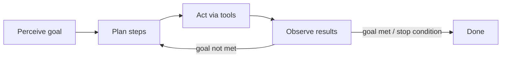

# AI agents: a quick refresher

Where a chatbot produces a response and waits for the next prompt, an **agent runs its own loop**: it perceives a goal, plans steps, takes actions through tools, observes the results, and iterates until the goal is met or it hits a stopping condition.

Every agent, simple or sophisticated, is built from the same parts:

- **Model** — the reasoning engine. Reads context, decides what happens next.
- **Tools** — connect the model to the world: APIs, code execution, databases, other agents.
- **Memory** — state. Recall past interactions, retrieve project rules, retain context across sessions.
- **Orchestration** — the code that runs the loop: assembles context, dispatches tool calls, captures results, decides whether to continue.
- **Deployment** — turns the prototype into a service: hosting, identity, observability, production infrastructure.

These parts work together in a continuous loop — get the mission, scan the scene, think it through, take action, observe and iterate. This loop is the foundation everything else in this paper builds on: vibe coding and agentic engineering are two different ways of configuring it, not two different things.
