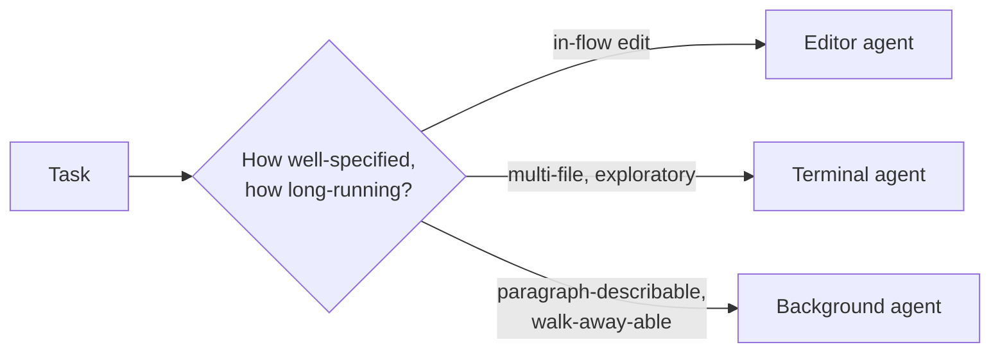

# Where coding agents fit in the developer's day

Coding agents show up in three places; most developers use all three at once.

- **In the editor** — inline completion, chat panels, whole-codebase awareness. Where most people first meet AI, and where the work stays in flow. *GitHub Copilot, Cursor, Windsurf, JetBrains AI Assistant.*
- **In the terminal** — launched from the command line, handed a goal in plain language, working across the codebase with full filesystem access, multi-file edits, and the ability to run tools/tests and iterate on results. *This is where serious vibe coding happens today.* *Antigravity CLI, Claude Code, Codex CLI, Open Code, Cline.*
- **In the background** — take a task, run autonomously in cloud-hosted sandboxes for hours, often producing a pull request. The developer hands off and reviews later. *Google Jules, Copilot agent mode, Cursor background agents, AlphaEvolve.*

The right starting point depends on the **task**, not on which category sits highest on some autonomy ladder.
