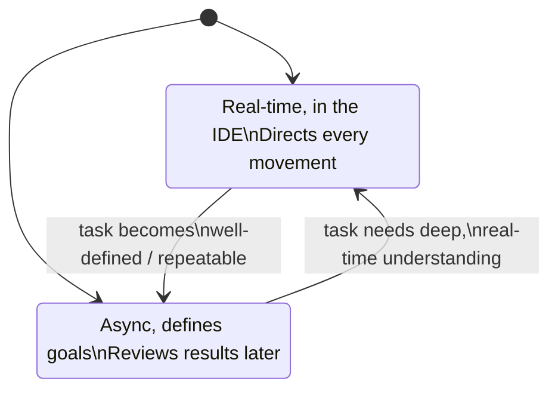

# Conductor and orchestrator

As AI takes over more implementation work, developers move fluidly between two modes:

**The conductor** works in real-time with an AI pair-programmer — in the IDE, watching code appear, guiding with prompts and corrections, maintaining fine-grained control. Typical for complex logic, tricky debugging, or unfamiliar codebases where every change needs to be understood as it's made. Tools: GitHub Copilot, Gemini Code Assist, Cursor, Windsurf. The risk: if the developer personally directs every keystroke, AI's throughput gain is capped.

**The orchestrator** operates at a higher level of abstraction — defines goals, assigns them to agents (possibly several, in parallel, in the background), reviews results, provides course corrections. Typical for well-defined bug fixes, feature implementation against established patterns, migrations, test generation. Tools: Jules, Copilot agent mode, Cursor background agents, Claude Code.

Orchestrator mode demands a different skill set than syntax fluency:

- **Specification** — defining tasks precisely enough that an agent can execute without ambiguity
- **Decomposition** — breaking large tasks into agent-sized units
- **Evaluation** — quickly assessing whether output meets the bar
- **System design** — designing the constraints, tests, and feedback loops that keep agents productive
