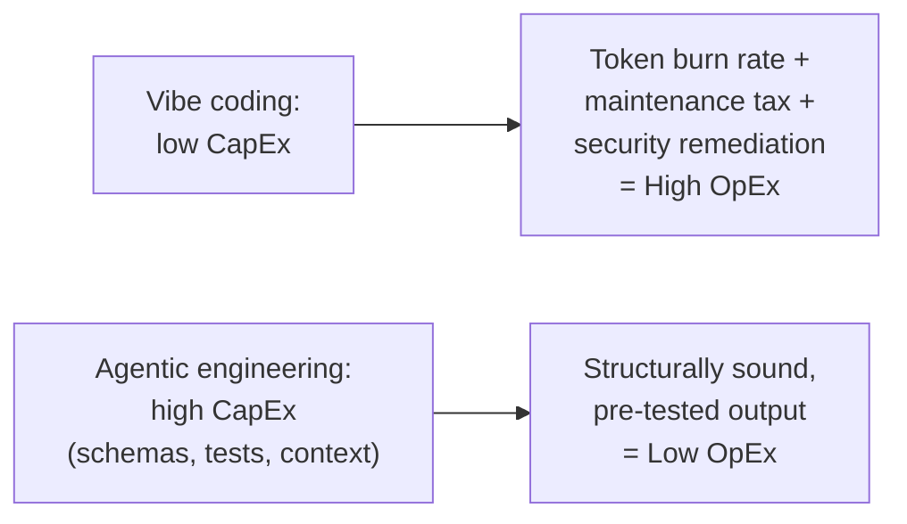

# The economics of AI development

The conversation about AI and the SDLC usually begins and ends with developer velocity — how fast can we write code? For engineering leaders, the more critical metric is **Total Cost of Ownership (TCO)**.

TCO splits into two buckets that AI shifts in opposite directions depending on how you work:

- **CapEx** — the upfront investment to build something.
- **OpEx** — the ongoing cost to run, fix, and maintain it. Crucially, in the AI era, OpEx is heavily dictated by the **token economy**.

| | Vibe coding | Agentic engineering |
|---|---|---|
| CapEx (upfront) | Low — a subscription and a few prompts | High — API schemas, test suites, structured context |
| OpEx (ongoing) | High — token burn, maintenance tax, security remediation | Low — output is structurally sound and pre-tested |

Vibe coding looks cost-effective at first glance — barrier to entry near zero. But it hides a compounding OpEx burden: a **token burn rate** from dumping unstructured files into context and repeatedly asking the model to fix its own unverified mistakes (an expensive "prompting loop" with low first-pass success); a **maintenance tax**, since ad-hoc-prompted code lacks structural consistency and a bug six months later means reverse-engineering AI-generated "spaghetti"; and **security remediation**, since rapid generation without an automated evaluation harness means rapid generation of vulnerabilities — and fixing a security flaw in production costs exponentially more than catching it at design time.

Agentic engineering flips the model: a deliberate, upfront investment (API schemas, deterministic test suites, structuring the agent's context) before a single line of production code is generated — in exchange for output that's structurally sound, pre-tested, and aligned with standards, dropping the marginal cost of shipping and maintaining each feature.
