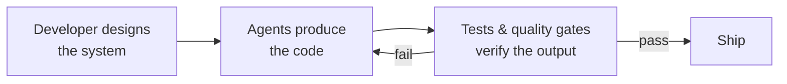

# The factory model: building the system that builds software

The mental model that ties the SDLC transformations together: the developer's primary output is **not code — it's the system that produces code**. That system includes:

- Specifications and context that define what needs to be built
- Agents that translate specifications into implementation
- Tests and quality gates that verify correctness
- Feedback loops that route failures back to agents for correction
- Guardrails that constrain agents to safe, predictable behavior

> "A factory manager does not assemble every widget by hand. They design the assembly line and ensure quality control. The modern developer designs the development system and ensures that its output meets the required standard."

Success comes from giving agents **success criteria** rather than step-by-step instructions, then letting them iterate. This reframes the central question of the paper: if the developer is the factory manager, what does the machine on the factory floor — the thing actually doing the work — look like?
