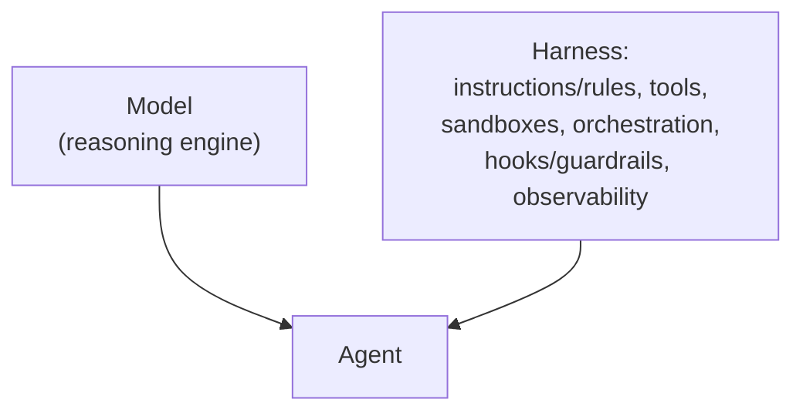

# Harness engineering: what surrounds the model

There's a temptation to treat the model as the system — new model, smarter agent; older model, worse agent. **That intuition is wrong, and it leads to the wrong investments.**

> "The model is one input into a running agent. Everything else — the prompts, the tools, the context policies, the hooks, the sandboxes, the sub-agents, the observability — is the harness: the scaffolding wrapped around the model that lets it actually finish something."

A raw model is not an agent. It becomes one once a harness gives it state, tool execution, feedback loops, and enforceable constraints.

What's concretely in a harness:

- **Instructions and rule files** — `AGENTS.md`, `CLAUDE.md`, `GEMINI.md`, skill files, sub-agent prompts.
- **Tools** — functions, MCP servers, APIs, plus the prose telling the model when/how to call them.
- **Sandboxes and execution environments** — where the agent's code actually runs, what it can and can't reach.
- **Orchestration logic** — sub-agent spawning, model routing, hand-offs between specialists.
- **Guardrails / hooks** — deterministic code at lifecycle points (before a tool call, after a file edit, before a commit) for things the agent should never forget but often does.
- **Observability** — logs, traces, evals, cost/latency metering. Without it, there's no way to tell if the agent is doing well or quietly drifting.

The behavior developers experience with Claude Code, Cursor, Codex, Antigravity, Aider, or Cline is dominated by what the harness does — not just which model sits underneath. And this surface area is the **team's** to own, not the model provider's.
