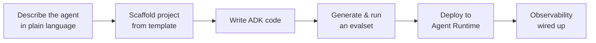

# Vibe coding production-ready agents

Everything so far has been about using coding agents to build software — features, bug fixes, tests, refactors. But what happens when the thing you need to build **is itself an agent**? A support bot handling refunds, a research assistant cross-referencing sources, a compliance monitor — these aren't terminal-coding-agent tasks. They're products that need their own tools, memory, evaluation, and deployment infrastructure.

> "For one-off scripts or personal automation, a regular coding agent is enough; the agent is the destination. For agents that serve real users at scale, the agent is the product, and it needs the substrate underneath."

Google's **Agents CLI** is built around this idea: a small command-line tool, bundling skills for building agents on Google Cloud, that works with whichever coding agent you already use. After a one-time install, the coding agent gains seven skills covering the full ADK lifecycle — scaffold a project, write the agent code, generate an evalset, deploy to Agent Runtime, wire up observability. You don't learn a new SDK; you describe what you want and the coding agent uses the skills to do the right thing at each step.

The same workflow scales from one agent to many: shared session state for simple coordination, **Model Context Protocol (MCP)** for tool access, **Agent2Agent (A2A)** for cross-agent delegation. In an early-2026 experiment, Anthropic's engineering team had agent teams running on this kind of architecture build a **working C compiler in Rust over two weeks** — humans set direction and reviewed output, but did not write the implementation. The bottleneck moved from writing the code to specifying what it should do and verifying that the agents did it.
