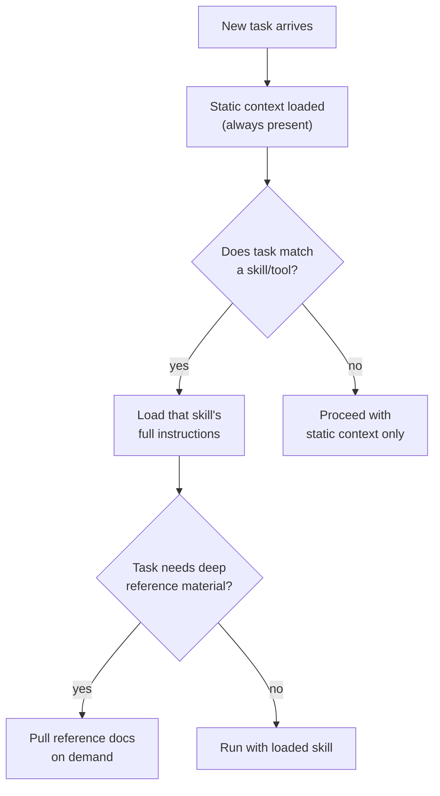

# Static vs. dynamic context

Context engineering involves balancing which of the six context types the agent possesses **upfront** versus what it can **retrieve on demand**.

- **Static context** is always loaded: system instructions, rule files (`AGENTS.md`, `CLAUDE.md`, `GEMINI.md`), global memory, persona definitions. It defines who the agent is. It's expensive — every token is present in *every* interaction, regardless of relevance.
- **Dynamic context** is loaded on demand: skill instructions triggered by task matching, tool results retrieved during execution, RAG documents, windowed session history. It's efficient — the agent pays the token cost only when the information is needed.

Too much static context wastes tokens and dilutes signal; too little means the agent forgets critical rules. The best systems treat this boundary as a first-class architectural decision — reviewed and versioned like any other configuration.

The most powerful pattern for dynamic context is **Agent Skills**: structured, portable packages of procedural knowledge loaded only when the task calls for it, through *progressive disclosure* — lightweight metadata at startup, full instructions when a task matches, deep reference material only when explicitly needed. Skills solve four recurring problems: context rot from overloaded prompts, the absence of procedural memory for LLMs, the operational overhead of multi-agent architectures, and the need for portability across tools and vendors.
