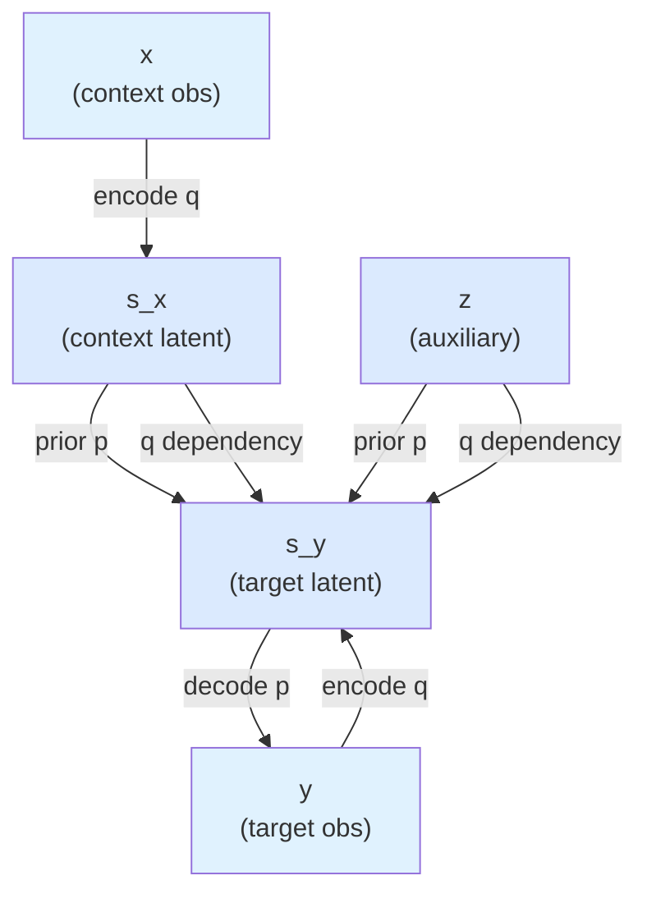

# From Deterministic to Probabilistic: The Variational Insight

## Reversing JEPA: what generative model yields this architecture?

The paper starts with a simple structural question: *if JEPA's coupled encoders were the posterior distributions of a VAE, what generative model would produce them?*

This leads to a directed acyclic graph (DAG) over context x, auxiliary variable z, target latents s_y, and target observation y:



The **generative model** (forward, p) is:
- x: observed (no distribution — you're given data)
- s_x ~ N(0, I): standard Gaussian prior
- z ~ N(0, I): standard Gaussian prior
- s_y | s_x, z ~ N(μ(s_x, z), Σ(s_x, z)): learned conditional Gaussian
- y | s_y ~ N(U(s_y), σ²I): learned Gaussian decoder

The **variational posterior** (q) factors as:
- q(s_x | x): encode context
- q(z | s_x): encode auxiliary variable from context latent
- q(s_y | s_x, z, y): encode target from context, auxiliary, and target observation

The target posterior depends on *all three* (s_x, z, y) to ensure it doesn't leak target information during training but can use it for regularization via reconstruction.

## Why the ELBO prevents collapse

Under this probabilistic view, the Evidence Lower Bound (ELBO) is:

```
ELBO = E_q[log p(y | s_y)] - KL(q(s_y | ...) || p(s_y | s_x, z))
       \_________________/   \_____________________________________/
       reconstruction         KL regularization
```

**The reconstruction term** forces s_y to encode information about y — if you're trying to reconstruct y from s_y, the latent must carry signal, not be constant.

**The KL divergence term** pushes the posterior toward the prior p(s_y | s_x, z). Since the prior is learned (it *is* the predictor g), this regularization is principled: you're not enforcing an arbitrary variance penalty, you're matching a learned distribution.

Together, they prevent collapse naturally. If s_x and z become constant, the KL divergence increases (the posterior can't match a non-informative prior). If s_y becomes constant, the reconstruction term vanishes. Both paths are penalized by the objective itself, not by ad-hoc regularizers.

## Reparameterization and sampling

To optimize the ELBO, use the **reparameterization trick**: instead of sampling z ~ q(.), rewrite it as z = μ(.) + σ(.) · ε where ε ~ N(0, I). This lets gradients flow through the sampling process, making the objective differentiable.

In practice: compute parameters (μ, σ) from neural networks, sample ε, and compute z = μ + σ * ε. Backprop through the whole chain. PyTorch's `Normal.rsample()` does this automatically.

## Connection to LeJEPA

LeJEPA (Balestriero & LeCun, 2025) adds SIGReg: a regularizer that matches the *aggregated* embedding distribution to an isotropic Gaussian N(0, I). Var-JEPA's per-sample KL against fixed priors is complementary — it provides per-sample uncertainty semantics while SIGReg enforces population-level isotropy. The paper shows that combining both can be beneficial.

— Adapted from Gögl & Yau (2026)
