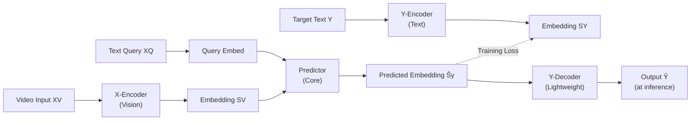

# Architecture & Design

## The Four Components

VL-JEPA has a deceptively simple structure. Instead of cramming everything into one giant encoder-decoder like classical VLMs, it splits the problem into four focused pieces:

### 1. X-Encoder: Compress Vision to Embeddings

The X-Encoder takes high-resolution video and produces a sequence of compact visual embeddings — think of them as learned "visual tokens."

In the paper:
- Model: V-JEPA 2 ViT-L (304M parameters, **frozen during training**)
- Input: Video frames at 256×256 resolution, sampled uniformly
- Output: A sequence of visual embeddings (one per patch)

The X-Encoder is frozen because vision-language alignment is already learned from pretraining. You're not trying to teach it new vision concepts — you're just extracting the representations it already knows.

### 2. Predictor: The Core Learning Component

The Predictor is where all the learning happens. It takes visual embeddings and the text query and predicts what the target embedding should be.

- Model: Last 8 Transformer layers of Llama-3.2-1B (490M trainable parameters)
- Inputs: Visual embeddings (from X-Encoder) + query embeddings (tokenized query text)
- Output: A single predicted embedding (pooled and projected)

The query is jointly attended with the vision embeddings — no causal mask. This lets both streams fully attend to each other when predicting the answer embedding.

### 3. Y-Encoder: Project Targets to Embedding Space

During training, you have the correct answer (the target text). The Y-Encoder embeds it into the same space where the Predictor makes its predictions.

- Model: EmbeddingGemma-300M
- Input: Target text (e.g., a caption or answer)
- Output: A single embedding in the shared 1,536-dimensional space

The Y-Encoder learns *how to map text to semantically meaningful embeddings* — it's trained alongside the Predictor (with a lower learning rate, ×0.05) to avoid instability early in training.

### 4. Y-Decoder: Convert Embeddings Back to Text (Inference Only)

This is the only component used at inference time. It translates the predicted embedding back into human-readable text.

- Model: Lightweight decoder (details not specified in the paper)
- Input: Predicted embedding
- Output: Text

Critically, the Y-Decoder is **not involved during main training**. You don't decode until you actually need to output text. This decoupling is what enables selective decoding — you can skip decoding when the embedding stream hasn't changed much.

## Data Flow During Training

When training on a triplet (Visual Input, Query, Target Text):

1. X-Encoder compresses the video into visual embeddings
2. Query is tokenized and embedded, then concatenated with visual embeddings
3. Predictor processes this joint representation → predicted embedding
4. Y-Encoder simultaneously processes the target text → target embedding
5. Loss is calculated as the distance between predicted and target embeddings in the shared space
6. **No decoding happens** — you never generate text during training

This is radically different from VLMs, which must decode and compare token sequences.

## Why This Design Matters

### Decoupled Inference

The separation between "prediction" (predictor) and "generation" (decoder) means:
- Prediction runs once per input (very fast)
- Decoding only runs when you decide to output text

For continuous video streams, you run the predictor 30+ times per second but decode only when semantics change significantly.

### Unified Embedding Space

All tasks (generation, classification, retrieval) operate in the same 1,536-dimensional space:
- **Generative**: Predict embedding → Decode to text
- **Discriminative**: Predict embedding → Compare to candidate embeddings (CLIP-style)
- **Retrieval**: Encode query → Compare to video embeddings

No architectural changes needed.

### Efficiency in Numbers

According to the paper:
- **Parameters**: 1.6B total vs. larger VLMs (2–72B)
- **Trainable**: 490M predictor + 300M Y-Encoder (X-Encoder is frozen)
- **Training data**: 3.6B samples for pretraining (vs. 86B for some baselines)
- **Inference**: Can avoid the expensive decoder entirely for retrieval/classification tasks
