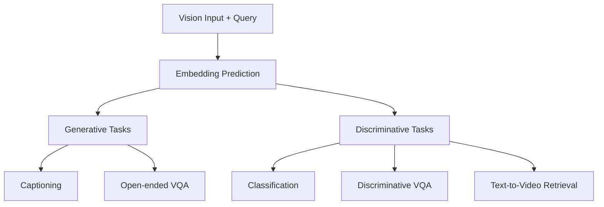

# Multi-task Capabilities

## One Architecture, Many Tasks

A classical VLM is built for *generative* tasks — it autoregressively generates text one token at a time. If you want to do classification, you either need to run the full generative pipeline and parse the output, or you build a separate classifier.

VL-JEPA's embedding space naturally supports both generative and discriminative tasks *without architectural modification*. The same trained model handles:

The model always predicts an embedding. Then, depending on what you need, you use different downstream tasks:

### 1. Generative Tasks: Decode the Embedding

**Captioning & Open-ended VQA**

You have a query ("What is happening?") and need a free-form text response.

1. Predictor outputs embedding $\hat{S}_Y$
2. Y-Decoder converts it to text
3. You read the human-readable output

This is exactly like a classical VLM but *without* autoregressive generation — the decoder is lightweight and runs once, not sequentially for each token.

### 2. Discriminative Tasks: Compare Embeddings (CLIP-style)

**Classification, Discriminative VQA, Retrieval**

For these tasks, you don't need text — you need to pick from a set of options.

**Classification example:**
- Video input: An action video
- Candidate labels: {"running", "walking", "jumping", ...}

Process:
1. Predictor outputs embedding $\hat{S}_Y$ for the video
2. Encode each label using the Y-Encoder: $\{S_{\text{"running"}}, S_{\text{"walking"}}, \ldots\}$
3. Find the label with highest cosine similarity to $\hat{S}_Y$

**Discriminative VQA example:**
- Video: Cooking scene
- Question: "What will happen if I flip this switch?"
- Candidate answers: {"lights turn on", "lights turn off", "nothing happens"}

Same process: encode each candidate with Y-Encoder, compare to predicted embedding, pick the closest.

**Text-to-Video Retrieval example:**
- Query: "A person cutting vegetables"
- Candidate videos: [video1, video2, video3, ...]

Process:
1. Encode the query text using Y-Encoder: $S_{\text{query}}$
2. For each candidate video, encode it as an embedding using the predictor (without a query, just visual understanding)
3. Rank videos by similarity to query embedding

> **Doesn't this require a separate "video-to-embedding" pass?** Yes — for retrieval, you encode candidate videos into their semantic embeddings, then rank them. This is still efficient because you're comparing embeddings, not running a decoder per video.

## Selective Decoding: The Killer Feature

Real-world video applications often process live streams — procedural assistance for smart glasses, robot navigation, online planning. A central challenge: **continuously update semantics as new frames arrive, but keep latency and compute low.**

Classical VLMs are expensive to run continuously because the decoder must complete the full sequence each time. VL-JEPA offers a native solution: **selective decoding.**

### The Mechanism

Instead of decoding every frame, you:

1. Run the predictor to get the embedding stream: $\{\hat{S}_{y,1}, \hat{S}_{y,2}, \ldots\}$ (one embedding per frame, very fast)
2. Stabilize the stream with simple averaging (moving average of recent embeddings)
3. Detect when the embedding stream shifts significantly (e.g., local variance exceeds a threshold)
4. Decode to text *only at those shift points*

Think of it like a semantic change detector: if the predicted embedding hasn't changed much, the answer probably hasn't changed, so don't decode.

### The Efficiency Gain

The paper evaluates selective decoding on EgoExo4D (6-minute videos with ~50 annotated events per video).

**Uniform decoding** (decode every frame or every N frames):
- If you decode every 10 frames on a 6-minute video at 30fps, that's ~1,080 decodes

**Selective decoding** (decode only on semantic shift):
- Only ~380 decodes (roughly 1 per 4 semantic events)
- Result: **~2.85× fewer decoding operations**
- **Quality maintained**: Average CIDEr scores are equivalent

This is a Pareto improvement — you get the same output quality with fewer operations. This is only possible because VL-JEPA decouples prediction (always-on) from decoding (on-demand).

### Continuous Monitoring with Low Latency

For real-time applications like live action tracking in smart glasses:

1. Stream video at 30fps
2. Run predictor for every frame (~30ms per frame batch)
3. Every frame, you have the semantic embedding
4. Decode only when variance spikes (e.g., new action starts)
5. Total latency: prediction + occasional decoding, not prediction + decoding every frame

A classical VLM would need explicit memory mechanisms or KV-cache optimizations to avoid decoding every frame. VL-JEPA supports it natively.

## Multi-task Unification in Practice

The paper evaluates the same model across all four task types:

### Zero-shot Classification
- Average accuracy on 8 datasets: 52.5% (VL-JEPA-Base) vs 44.7% (best baseline PE-Core)
- Particularly strong on motion-centric tasks (SSv2, EK-100, EgoExo4D)

### Text-to-Video Retrieval
- Average recall@1 on 8 datasets: 63.7% (VL-JEPA-Base) vs 58.1% (best baseline)

### Open-ended VQA (Discriminative)
- GQA: 61.5% (comparable to InstructBLIP: 49.5%)
- TallyQA: 69.9% (vs InstructBLIP: 68%)
- POPE (object hallucination): 85.7% (vs LLaVA-1.5-13B: 86.3%)
- POPEv2: 86.3% (vs Qwen2-VL-7B: 87%)

### Specialized Task: Action Anticipation
- On EPIC-KITCHENS-100, VL-JEPA outperforms V-JEPA 2 (the vision-only baseline)
- Achieves 34.2% recall@5 at 1-second anticipation vs 32.7% for vision-only

All with **a single unified architecture and 1.6B parameters**.

## Design Trade-off: Generalist vs. Specialist

A specialist model (e.g., a classifier built just for image classification) will likely outperform VL-JEPA on that single task. But VL-JEPA's unification offers:

- **One model**, not many
- **Lower memory footprint**
- **Faster inference** for discriminative tasks (no decoding)
- **Flexible task adaptation** (same embedding space, different downstream operations)

This is the JEPA philosophy: learn a good abstract representation, then build whatever you need on top of it.
