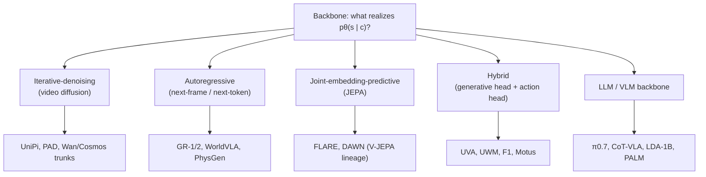

# The Anatomy, Ingredient 3: Five Families That Produce the Prediction

Substrate fixed, coupling chosen — now *what function family* actually computes `pθ(· | c)`? The survey groups every WAM backbone into **five families**, each with its own canonical equation. The key warning up front:

> "The five families are not mutually exclusive and the dividing lines move every few months." — *Section 4.4.6*

## 1. Iterative-denoising (video diffusion)

Predict the future by running a learned **reverse process** that denoises Gaussian noise into the substrate over `N_diff` steps:

> Ldiff = E [ ‖ ε − εθ(s⁽ⁿ⁾, n, c) ‖² ]  — score-matching, *Equation 22*

The dominant topology is a **video diffusion transformer** attending jointly over space and time (Latte, CogVideoX, Wan, Cosmos-Predict2). Because diffusion denoises a *whole window at once*, its coupling landscape is narrower than autoregression's — but it still supports all three couplings (action-conditioned rollout when a chunk is proposed before the reverse chain; joint generation on the `(s,a)` variable; post-prediction head after `s⁽⁰⁾` is denoised).

> **Is flow matching a sixth family?** No. Flow matching just swaps the noise-predictor `εθ` for a velocity-field predictor `vθ`, but it still satisfies the same iterative-reverse-chain parameterization of Equation 21. The survey is explicit: it's *"not a new backbone family but a different choice of the score parameterization."* 3D-FDP, EVA, DriveVA, and CreFlow run flow matching inside the diffusion family.

## 2. Autoregressive (next-frame, next-token)

Serialize the generated variables into a causal stream and predict one element at a time:

> pθ(y1:M | car) = ∏j pθ(yj | y&lt;j, car)  — *Equation 25*

A key-value cache reuses prefix computation, so each new element is one forward pass over the new tokens — not a recomputation. The survey makes one correction loudly:

> "[The map] is only a backbone-level map. Its purpose is to prevent the common confusion that autoregression implies joint action prediction." — *Section 4.4.2*

An autoregressive stream might predict *only* the future substrate (action supplied to the rollout or decoded later), or it might *jointly* emit frame and action tokens (WorldVLA, PhysGen, GR-1/GR-2). The backbone and the coupling are independent. The family's pressure is **serial cost** — when an AR WAM misses a control budget, inspect the serialized substrate size, the chunk length, and whether actions live in the same causal stream or a cheaper head.

## 3. Joint-embedding-predictive (JEPA)

The odd one out: it realizes `pθ(s | c)` as a **Dirac at a deterministic predictor**, not a stochastic density. A context encoder and an EMA target encoder are trained with a predictor that maps context features to target features under a stop-gradient:

> Ljepa = E ‖ fθpred(Ectx(xctx)) − sg[Etgt(xtgt)] ‖²  — *Equation 28*

The substrate *is* `E_tgt(x_tgt)`, and the prediction collapses to a single point. The backbone never inverts `E_tgt`, which makes the inference loop **cheap** — that's the family's appeal. JEPA predicts the substrate *only*; actions enter via action-conditioned rollout (V-JEPA 2's MPC over latent rollouts) or a post-prediction head (FLARE). The catch:

> "The embedding space has no intrinsic visual quality measure, so downstream-task accuracy becomes the only standard test of the world model." — *Section 4.4.3*

## 4. Hybrid (generative head + action head)

One shared trunk `gθ(c)` feeds **two heads** — a substrate head `hˢ` and an action head `hᵃ` — trained under the same `L_gen(s) + λL_act(a)` objective. Because the trunk feeds both in one place, **every coupling family can appear here**, decided by how you *order* the heads around the trunk: both jointly (joint generation, e.g. UVA, UWM), substrate-then-action (post-prediction head, e.g. FRAPPE, Genie Envisioner), or wrap-with-a-planner (action-conditioned rollout, e.g. 3D-ALP, PointWorld). This is the busiest family — F1, Motus, MotuBrain, BagelVLA, τ0-WM, WALL-WM all live here, varying the schedule and exchange pattern.

## 5. LLM- / VLM-backbone

Build the WAM directly on a language or vision-language model, *without* a video-generation trunk as the policy backbone:

> st+1:t+H ∼ VLMθ(prompt(c)),  at:t+H−1 ∼ qψ(· | st+1:t+H, c)  — *Equation 32*

The natural substrate is the **VLM-token** feature variant — the future is a token block in the VLM's vocabulary. The gate that keeps it a WAM (and not just a VLA): a future substrate — future tokens, subgoal images, motion representations, affordance maps — must be present in the *inference-time control context*.

> "A VLM policy that maps observations directly to action tokens, without predicting or consuming such a future substrate, falls outside this family under our definition." — *Section 4.4.5*

π0.7 conditions on generated subgoal images; CoT-VLA writes a visual chain-of-thought; LDA-1B forecasts in a DINO latent on a Qwen3-VL backbone; PALM uses affordance maps. The family inherits the VLM stack's cost rather than video diffusion's — which is why members lean on action chunking and a frozen backbone.

## The takeaway

> "A practitioner who fixes the substrate... has narrowed the backbone choices by construction, since not every substrate is compatible with every family." — *Section 4.4.6*

The five families aren't a free menu — your substrate choice already eliminates most of them. What's left is *where the prediction lands relative to the control loop* — the deployment regime, and the final ingredient.
