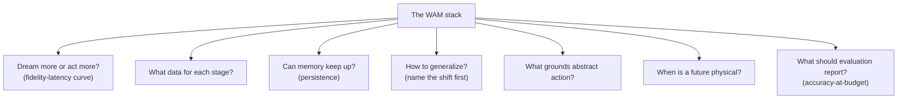

# Open Challenges: Where the Four Axes Point Next

The survey ends by using its own four-axis anatomy as a map of unsolved problems. Each challenge is anchored to a place in the WAM stack — and the closing warning is that they're all entangled:

> "A WAM should be advanced as one coupled design space, where progress on one challenge changes the practical trade-offs of the others." — *Section 7*

## 1. Dream more or act more? — the central tension, made a knob

Richer futures improve the substrate but lengthen the path from observation to control. The field splits: some methods extract *just enough* future structure (S-VAM distills foresight features, Fast-WAM removes the future-video branch, GigaWorld-Policy masks attention to skip video), others keep heavy imagination and pay in latency (DreamZero, CosmosPolicy, NovaPlan).

> "The open problem is not simply to make every model smaller. It is to expose a controllable fidelity-latency curve, so a WAM can choose how much future information the action actually needs." — *Section 7.1*

And that choice should become a **runtime** decision: spend generative compute by *expected action value* — more near uncertainty, contact, or irreversible error; less on routine transit. A binary execute-or-replan trigger (FFDC-WAM) is too coarse; it can't decide *how much* of the horizon to regenerate.

## 2. What data should each stage learn from?

Pooling data sources hides which variable each one supervises. The challenge is to assign each source to a **stage, objective, and model component**:

- **Pretraining** — broad video, but *"which kind of video teaches the dynamics the later action path will need?"* VidMan finds robot-domain pretraining helps while a *mismatched* egocentric source can *hurt* the same setting.
- **Alignment** — egocentric/paired human data bridges passive video to control, but EgoVerse finds **scene diversity can matter more than raw volume.**
- **Final action** — the sharpest bottleneck. Action-free recipes (LAPA, DUST, ALAM, LDA-1B) cut labeled-control needs but never remove them: *"every abstract action still needs a decoder, an inverse-dynamics model, or a robot-specific calibration step."*

> The missing result: *"a joint scaling law over source, stage, quality, model size, and action grounding."* Without it, adding data is an engineering guess, not a design decision.

## 3. Can memory keep up?

Persistence is more than a longer horizon. The real demand:

> "Its memory cost should grow with scene complexity rather than with episode length." — *Section 7.3*

Autoregressive prediction exposes the failure directly (IRASim drifts despite overlapping context; PhysGen is bounded by a fixed context). The ingredients exist separately — test-time memory bounds recall but risks forgetting; Dreamer 4's compact latent supports continual imagination but loses object-level spatial detail. The challenge is to **combine bounded memory, spatial indexing, and observation replacement** into one method that stays reactive over long tasks.

## 4. How can WAMs generalize? — name the shift first

> "A WAM therefore cannot be made generalizable by adding scale alone. The target shift has to be named first." — *Section 7.4*

Appearance, object dynamics, morphology, action space, camera placement, and contact regime stress *different parts* of the model. Domain randomization is a sharp test: Act2Goal drops steeply under harder conditions; FRAPPE stays below a practical rate even when it leads its baselines.

> "Future prediction helps only when the predicted substrate matches the shift that the action path must absorb." — *Section 7.4*

The prescription: design for a *declared* shift before training, then test whether the chosen substrate and action decoder generalize across *that* shift — not report transfer after the fact.

## 5. What grounds abstract action?

Replacing raw control with a latent code, flow field, or point track unlocks action-free learning — but risks losing a *physical handle*. Two failure modes:

- **Estimator dependence** — 2D object flow can't represent depth, out-of-plane rotation, or contact force; a rigid-transform decoder breaks on articulated/deformable objects; adapters inherit tracker and depth-estimator errors.
- **Opacity** — LAPA's codebook is too coarse for fine grasping; ALAM's algebraic consistency is *"a composition law rather than a force, torque, or contact explanation."*

> The challenge: keep the data advantage of abstract actions while adding **a physical grounding signal and an inspection handle** for failure analysis.

## 6. When is a future physical?

> "A future can look plausible while failing the embodiment." — *Section 7.6*

The clean example: a flow-based world model conditioned on one frame **can't encode object velocity**, so push tasks fail when the object keeps moving after contact ends. Tactile force proxies are uncalibrated; point-cloud substrates omit force magnitude, friction, and compliance; even an executability reward can miss contact if it only scores smoothness and joint limits. The challenge is to **train and evaluate futures for being executable by the embodiment**, not merely visually convincing.

## 7. What should evaluation report? — accuracy-at-budget

World-model quality isn't yet a reliable proxy for policy utility (MotuBrain finds only weak correlation between its world-model score and downstream success). And a single success number hides opposite regimes — HarmoWAM shows a schedule good for *transit* can fail at *precise interaction*; averaging the phases erases the failure the test should expose.

> "A WAM that succeeds slowly is not equivalent to one that acts at the control rate, and a WAM that succeeds over a short horizon is not equivalent to one that keeps state over a long task." — *Section 7.7*

The missing protocol: **accuracy-at-budget** — put success, latency, sustained horizon, peak memory, and contact-sensitive failure tags *on the same axis*.

## The thesis, one more time

> "Across the works considered here, the common trajectory is not simply toward larger video prediction, but toward more selective imagination that keeps the parts of the future needed for action and discards the rest." — *Section 8*

A WAM is a **contract between prediction and control**: given past observations, past actions, and a task, anticipate the actionable future *and* produce the action that should follow. That framing is what separates WAMs from world models, video generators, and plain VLAs — and it's why the field's direction is, exactly, **Dream Less, Act More**.
